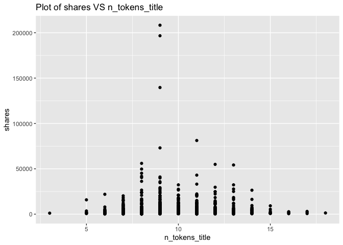
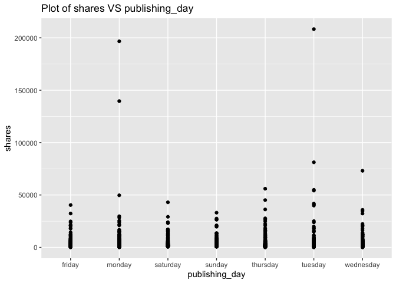
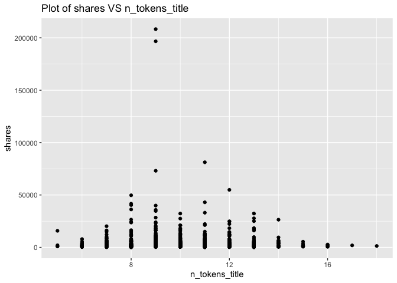
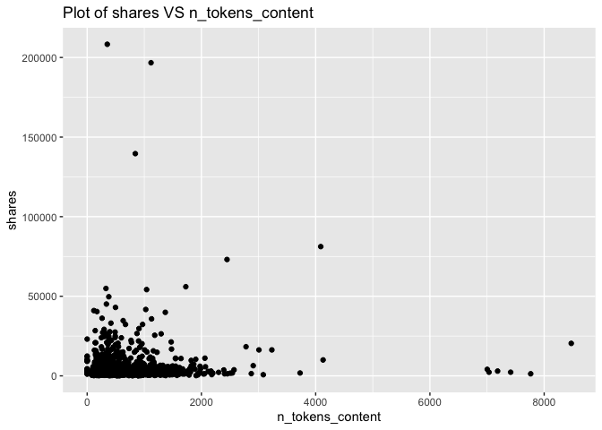
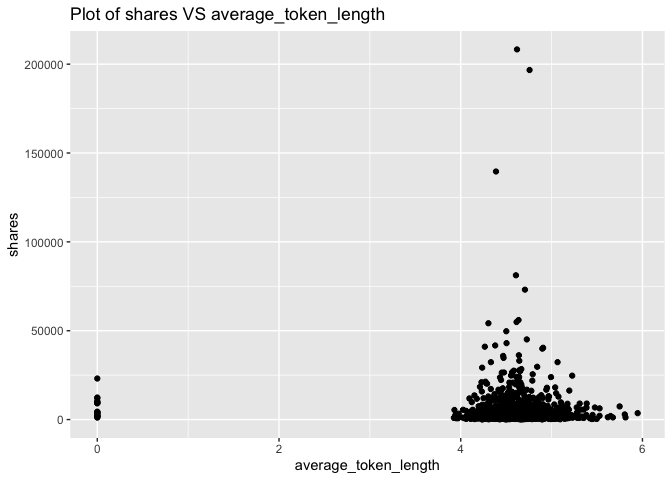
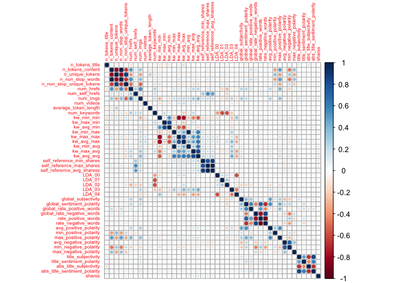

ST558 - Project 2
================
Li Wang & Bryan Bittner
2022-07-07

# Load Packages

We will use the following packages:

``` r
library(httr)
library(jsonlite)
library(readr)
library(tidyverse)
library(lubridate)
library(knitr)
library(caret)
library(randomForest)
library(corrplot)
library(gbm)
```

# Introduction

This data set summarizes a heterogeneous set of features about articles
published by Mashable in a period of two years.

Our target variable is the shares variable, and predict variables are
the following:

publishing\_day: Day of the article published n\_tokens\_title: Number
of words in the title n\_tokens\_content: Number of words in the content
num\_self\_hrefs: Number of links to other articles published by
Mashable num\_imgs: Number of images num\_videos: Number of videos
average\_token\_length: Average length of the words in the content
num\_keywords: Number of keywords in the metadata kw\_avg\_min: Worst
keyword (avg. shares) kw\_avg\_avg: Avg. keyword (avg. shares)
self\_reference\_avg\_shares: Avg. shares of referenced articles in
Mashable LDA\_04: Closeness to LDA topic 4 global\_subjectivity: ext
subjectivity global\_rate\_positive\_words: Rate of positive words in
the content rate\_positive\_words: Rate of positive words among
non-neutral tokens avg\_positive\_polarity: Avg. polarity of positive
words min\_positive\_polarity: Min. polarity of positive words
avg\_negative\_polarity: Avg. polarity of negative words
max\_negative\_polarity: Max. polarity of negative words
title\_subjectivity: Title subjectivity

The purpose of our analysis is to predict the number of shares in social
networks (popularity). In this project, we produce some basic (but
meaningful) summary statistics and plots about the training data, and
fit a linear regression model and an ensemble tree-based model for
predicting the number of shares.

# Data

Use a relative path to import the data.

``` r
newsData<-read_csv(file="../Datasets/OnlineNewsPopularity.csv")
head(newsData)
```

    ## # A tibble: 6 × 61
    ##   url                  timedelta n_tokens_title n_tokens_content n_unique_tokens
    ##   <chr>                    <dbl>          <dbl>            <dbl>           <dbl>
    ## 1 http://mashable.com…       731             12              219           0.664
    ## 2 http://mashable.com…       731              9              255           0.605
    ## 3 http://mashable.com…       731              9              211           0.575
    ## 4 http://mashable.com…       731              9              531           0.504
    ## 5 http://mashable.com…       731             13             1072           0.416
    ## 6 http://mashable.com…       731             10              370           0.560
    ## # … with 56 more variables: n_non_stop_words <dbl>,
    ## #   n_non_stop_unique_tokens <dbl>, num_hrefs <dbl>, num_self_hrefs <dbl>,
    ## #   num_imgs <dbl>, num_videos <dbl>, average_token_length <dbl>,
    ## #   num_keywords <dbl>, data_channel_is_lifestyle <dbl>,
    ## #   data_channel_is_entertainment <dbl>, data_channel_is_bus <dbl>,
    ## #   data_channel_is_socmed <dbl>, data_channel_is_tech <dbl>,
    ## #   data_channel_is_world <dbl>, kw_min_min <dbl>, kw_max_min <dbl>, …

Subset the data to work on the data channel of lifestyle

``` r
#Once we parameterize this file, part of the column name will be passed in as a parameter by the render code. I'm creating a separate field to handle this portion of the column name now and eventually we can just set the parameter to this field and the rest should work.

#Parameter Name will eventually go here instead of "lifestyle"
paramColumnNameType<-"lifestyle"
columnName<-paste("data_channel_is_",paramColumnNameType,sep="")

#According to dplyr help, to refer to column names stored as string, use the '.data' pronoun.
#https://dplyr.tidyverse.org/reference/filter.html
newsDataSubset <- filter(newsData,.data[[columnName]] == 1)
```

Merging the weekdays columns channels as one single column named
publishing\_day

``` r
# Merging the weekdays columns channels as one single column named publishing_day
newsDataSubset <- newsDataSubset %>%
  select(url, starts_with("weekday_is")) %>%
  pivot_longer(-url) %>%
  dplyr::filter(value > 0) %>%
  mutate(publishing_day = gsub("weekday_is_", "", name)) %>%
  left_join(newsDataSubset, by = "url") %>%
  select(-name, -starts_with("weekday_is_"))

# set the publishing_day as factor variable
newsDataSubset$publishing_day<- as.factor(newsDataSubset$publishing_day)
head(newsDataSubset)
```

    ## # A tibble: 6 × 56
    ##   url             value publishing_day timedelta n_tokens_title n_tokens_content
    ##   <chr>           <dbl> <fct>              <dbl>          <dbl>            <dbl>
    ## 1 http://mashabl…     1 monday               731              8              960
    ## 2 http://mashabl…     1 monday               731             10              187
    ## 3 http://mashabl…     1 monday               731             11              103
    ## 4 http://mashabl…     1 monday               731             10              243
    ## 5 http://mashabl…     1 monday               731              8              204
    ## 6 http://mashabl…     1 monday               731             11              315
    ## # … with 50 more variables: n_unique_tokens <dbl>, n_non_stop_words <dbl>,
    ## #   n_non_stop_unique_tokens <dbl>, num_hrefs <dbl>, num_self_hrefs <dbl>,
    ## #   num_imgs <dbl>, num_videos <dbl>, average_token_length <dbl>,
    ## #   num_keywords <dbl>, data_channel_is_lifestyle <dbl>,
    ## #   data_channel_is_entertainment <dbl>, data_channel_is_bus <dbl>,
    ## #   data_channel_is_socmed <dbl>, data_channel_is_tech <dbl>,
    ## #   data_channel_is_world <dbl>, kw_min_min <dbl>, kw_max_min <dbl>, …

Here we drop some non-preditive variables:
url,value,timedelta,data\_channel\_is\_lifestyle,
data\_channel\_is\_entertainment,data\_channel\_is\_bus,
data\_channel\_is\_socmed
,data\_channel\_is\_tech,data\_channel\_is\_world columns,is\_weekend.
They won’t contribute anything.

``` r
newsDataSubset<-newsDataSubset%>%select(-c(1,2,4,16:21,34))
```

## Summarizations

Start with the data structure and basic summary statistics for the
‘shares’ field.

``` r
# data structure
str(newsDataSubset)
```

    ## tibble [2,099 × 46] (S3: tbl_df/tbl/data.frame)
    ##  $ publishing_day              : Factor w/ 7 levels "friday","monday",..: 2 2 2 2 2 2 2 2 6 7 ...
    ##  $ n_tokens_title              : num [1:2099] 8 10 11 10 8 11 10 6 12 11 ...
    ##  $ n_tokens_content            : num [1:2099] 960 187 103 243 204 315 1190 374 499 223 ...
    ##  $ n_unique_tokens             : num [1:2099] 0.418 0.667 0.689 0.619 0.586 ...
    ##  $ n_non_stop_words            : num [1:2099] 1 1 1 1 1 ...
    ##  $ n_non_stop_unique_tokens    : num [1:2099] 0.55 0.8 0.806 0.824 0.698 ...
    ##  $ num_hrefs                   : num [1:2099] 21 7 3 1 7 4 25 7 14 5 ...
    ##  $ num_self_hrefs              : num [1:2099] 20 0 1 1 2 4 24 0 1 3 ...
    ##  $ num_imgs                    : num [1:2099] 20 1 1 0 1 1 20 1 1 0 ...
    ##  $ num_videos                  : num [1:2099] 0 0 0 0 0 0 0 0 0 0 ...
    ##  $ average_token_length        : num [1:2099] 4.65 4.66 4.84 4.38 4.67 ...
    ##  $ num_keywords                : num [1:2099] 10 7 6 10 8 10 8 8 10 6 ...
    ##  $ kw_min_min                  : num [1:2099] 0 0 0 0 0 0 0 0 217 217 ...
    ##  $ kw_max_min                  : num [1:2099] 0 0 0 0 0 0 0 0 1500 1900 ...
    ##  $ kw_avg_min                  : num [1:2099] 0 0 0 0 0 ...
    ##  $ kw_min_max                  : num [1:2099] 0 0 0 0 0 0 0 0 0 0 ...
    ##  $ kw_max_max                  : num [1:2099] 0 0 0 0 0 0 0 0 17100 17100 ...
    ##  $ kw_avg_max                  : num [1:2099] 0 0 0 0 0 ...
    ##  $ kw_min_avg                  : num [1:2099] 0 0 0 0 0 0 0 0 0 0 ...
    ##  $ kw_max_avg                  : num [1:2099] 0 0 0 0 0 ...
    ##  $ kw_avg_avg                  : num [1:2099] 0 0 0 0 0 ...
    ##  $ self_reference_min_shares   : num [1:2099] 545 0 5000 0 0 6200 545 0 1300 6700 ...
    ##  $ self_reference_max_shares   : num [1:2099] 16000 0 5000 0 0 6200 16000 0 1300 16700 ...
    ##  $ self_reference_avg_sharess  : num [1:2099] 3151 0 5000 0 0 ...
    ##  $ LDA_00                      : num [1:2099] 0.0201 0.0286 0.4374 0.02 0.2115 ...
    ##  $ LDA_01                      : num [1:2099] 0.1147 0.0286 0.2004 0.02 0.0255 ...
    ##  $ LDA_02                      : num [1:2099] 0.02 0.0286 0.0335 0.02 0.0251 ...
    ##  $ LDA_03                      : num [1:2099] 0.02 0.0287 0.0334 0.02 0.0251 ...
    ##  $ LDA_04                      : num [1:2099] 0.825 0.885 0.295 0.92 0.713 ...
    ##  $ global_subjectivity         : num [1:2099] 0.514 0.477 0.424 0.518 0.652 ...
    ##  $ global_sentiment_polarity   : num [1:2099] 0.268 0.15 0.118 0.156 0.317 ...
    ##  $ global_rate_positive_words  : num [1:2099] 0.0802 0.0267 0.0291 0.0494 0.0735 ...
    ##  $ global_rate_negative_words  : num [1:2099] 0.01667 0.0107 0.00971 0.02058 0.0049 ...
    ##  $ rate_positive_words         : num [1:2099] 0.828 0.714 0.75 0.706 0.938 ...
    ##  $ rate_negative_words         : num [1:2099] 0.172 0.2857 0.25 0.2941 0.0625 ...
    ##  $ avg_positive_polarity       : num [1:2099] 0.402 0.435 0.278 0.333 0.422 ...
    ##  $ min_positive_polarity       : num [1:2099] 0.1 0.2 0.0333 0.1364 0.1 ...
    ##  $ max_positive_polarity       : num [1:2099] 1 0.7 0.5 0.6 1 0.5 1 0.8 0.5 0.5 ...
    ##  $ avg_negative_polarity       : num [1:2099] -0.224 -0.263 -0.125 -0.177 -0.4 ...
    ##  $ min_negative_polarity       : num [1:2099] -0.5 -0.4 -0.125 -0.312 -0.4 ...
    ##  $ max_negative_polarity       : num [1:2099] -0.05 -0.125 -0.125 -0.125 -0.4 -0.125 -0.05 -0.05 -0.1 -0.1 ...
    ##  $ title_subjectivity          : num [1:2099] 0 0 0.857 0 0 ...
    ##  $ title_sentiment_polarity    : num [1:2099] 0 0 -0.714 0 0 ...
    ##  $ abs_title_subjectivity      : num [1:2099] 0.5 0.5 0.357 0.5 0.5 ...
    ##  $ abs_title_sentiment_polarity: num [1:2099] 0 0 0.714 0 0 ...
    ##  $ shares                      : num [1:2099] 556 1900 5700 462 3600 343 507 552 1200 1900 ...

``` r
# data summary
summary(newsDataSubset$shares)
```

    ##    Min. 1st Qu.  Median    Mean 3rd Qu.    Max. 
    ##      28    1100    1700    3682    3250  208300

Now lets show the Mean, Median, Variance, and Standard Deviation. Notice
the Variance and Standard Deviation are both extremely high. This might
be something we will have to investigate further.

``` r
newsDataSubset %>% summarise(avg = mean(shares), med = median(shares), var = var(shares), sd = sd(shares))
```

    ## # A tibble: 1 × 4
    ##     avg   med       var    sd
    ##   <dbl> <dbl>     <dbl> <dbl>
    ## 1 3682.  1700 78943534. 8885.

Looking at the different columns in the dataset, there are two that
stand out. Generally speaking, people probably aren’t going to look at
articles that don’t have images or videos. Here are the summary stats
for the articles grouped on the number of images in the article.

``` r
newsDataSubset %>% group_by(num_imgs) %>%
summarise(avg = mean(shares), med = median(shares), var = var(shares), sd = sd(shares))
```

    ## # A tibble: 46 × 5
    ##    num_imgs   avg   med       var    sd
    ##       <dbl> <dbl> <dbl>     <dbl> <dbl>
    ##  1        0 3412.  1600 28214771. 5312.
    ##  2        1 3505.  1500 93048735. 9646.
    ##  3        2 3684.  1500 78338969. 8851.
    ##  4        3 2765.  1700  8254428. 2873.
    ##  5        4 2878.  1450 21072041. 4590.
    ##  6        5 4399.  1850 71679990. 8466.
    ##  7        6 3166.  1500 22453761. 4739.
    ##  8        7 3307.  2250  7191557. 2682.
    ##  9        8 2809.  1800 11789849. 3434.
    ## 10        9 3825.  2100 34583426. 5881.
    ## # … with 36 more rows

As we can see from the above table, the largest avg of shares is with 27
images, and the least avg of shares is with 23 images. Therefore, the
number of images variable is affect shares, we will keep this variable.

Here are the summary stats for articles with videos.

``` r
newsDataSubset %>% group_by(num_videos) %>%
summarise(avg = mean(shares), med = median(shares), var = var(shares), sd = sd(shares))
```

    ## # A tibble: 18 × 5
    ##    num_videos     avg    med        var     sd
    ##         <dbl>   <dbl>  <dbl>      <dbl>  <dbl>
    ##  1          0   3539.   1700  69852475.  8358.
    ##  2          1   3694.   1700  30530526.  5525.
    ##  3          2   3102.   1800  14805400.  3848.
    ##  4          3   4190.   1800  41021110.  6405.
    ##  5          4   4796.   2000  35265460.  5938.
    ##  6          5   5650.   1450 117552386. 10842.
    ##  7          6  12475    7050 124409167. 11154.
    ##  8          7   9033    7050  99351823.  9968.
    ##  9          8    978.   1000     18196.   135.
    ## 10          9   3950    3950  16245000   4031.
    ## 11         10   2154.   1500   2250928.  1500.
    ## 12         11   2480    2500    537000    733.
    ## 13         12   4400    4400   8000000   2828.
    ## 14         15 196700  196700        NA     NA 
    ## 15         21  19800   19800        NA     NA 
    ## 16         26   2300    2300        NA     NA 
    ## 17         28    660     660        NA     NA 
    ## 18         50    932     932        NA     NA

As we can see from the above table, the largest avg of shares is with 15
videos, and the least avg of shares is with 28 videos Therefore, the
number of videos variable is affect shares, we will keep this variable.

A plot with the number of shares on the y-axis and n\_tokens\_title on
the x-axis is created:

``` r
g <- ggplot(newsDataSubset, aes(x = n_tokens_title, y = shares))
g + geom_point()+labs(title = "Plot of shares VS n_tokens_title")
```

<!-- -->

From the above plot, we can see that the most shares is with 6-15 words
in the title. Therefore, we will keep n\_tokens\_title variable.

A plot with the number of shares on the y-axis and publishing\_day on
the x-axis is created:

``` r
g <- ggplot(newsDataSubset, aes(x = publishing_day, y = shares))
g + geom_point()+labs(title = "Plot of shares VS publishing_day")
```

<!-- -->

From the above plot, we can see that the best popular articles are
usually posted on Monday, Tuesday, and Wednesday. Articles is less
popularity which are published on Sunday and Saturday. Therefore, we
will keep publishing\_day.

A plot with the number of shares on the y-axis and rate\_positive\_words
on the x-axis is created:

``` r
g <- ggplot(newsDataSubset, aes(x = rate_positive_words, y = shares))
g + geom_point()+labs(title = "Plot of shares VS rate_positive_words")
```

<!-- -->

From the above plot, we can see that the best popular articles are with
0.5-0.9 rate\_positive\_words. Therefore, the variable
rate\_positive\_words effect to shares, we will keep this variable.

A plot with the number of shares on the y-axis and n\_tokens\_content on
the x-axis is created:

``` r
g <- ggplot(newsDataSubset, aes(x = n_tokens_content, y = shares))
g + geom_point()+labs(title = "Plot of shares VS n_tokens_content")
```

<!-- -->

From the above plot, we can see that the number of words in the article
less than 1500 words are with good shares. The lesser the better.
Therefore, the variable n\_tokens\_content effect to shares, we will
keep this variable.

A plot with the number of shares on the y-axis and
average\_token\_length on the x-axis is created:

``` r
g <- ggplot(newsDataSubset, aes(x = average_token_length, y = shares))
g + geom_point()+labs(title = "Plot of shares VS average_token_length")
```

<!-- -->

From the above plot, we can see that the almost shares are with 4-6
length word. Therefore, the variable average\_token\_length effect to
shares, we will keep this variable.

Correlation matrix plot is generated:

``` r
newsDataSubset1<-select(newsDataSubset,-publishing_day)
corr=cor(newsDataSubset1, method = c("spearman"))
corrplot(corr,tl.cex=0.5)
```

<!-- -->

By the above correlation matrix plot, we can see these variables are
strongly correlated:

  - title\_subjectivity, abs\_title\_sentiment\_polarity,
    abs\_title\_subjectivity, title\_sentiment\_polarity
  - avg\_negative\_polarity, min\_negative\_polarity
  - max\_positive\_polarity, avg\_positive\_polarity
  - global\_rate\_negative\_words,
    rate\_negative\_words,rate\_positive\_words
  - global\_sentiment\_polarity, rate\_negative\_words,
    rate\_positive\_words
  - LDA\_03,LDA\_04
  - LDA\_00,LDA\_04
  - self\_reference\_max\_shares, self\_reference\_avg\_shares,
    self\_reference\_min\_shares
  - kw\_max\_avg, kw\_avg\_avg
  - kw\_min\_avg,kw\_avg\_avg,kw\_min\_max
  - kw\_avg\_max,kw\_avg\_avg,kw\_max\_max
  - kw\_avg\_min,kw\_avg\_max
  - kw\_max\_min,kw\_avg\_min,kw\_min\_min
  - kw\_min\_min,kw\_avg\_max
  - num\_keywords,LDA\_01
  - num\_keywords,LDA\_02
  - num\_hrefs, num\_imgs
  - n\_non\_stop\_unique\_tokens, num\_imgs
  - n\_non\_stop\_words, n\_non\_stop\_unique\_tokens
  - n\_unique\_tokens,n\_non\_stop\_unique\_tokens
  - n\_unique\_tokens, n\_non\_stop\_words, n\_tokens\_content
  - n\_tokens\_content, n\_non\_stop\_unique\_tokens
  - n\_tokens\_content, num\_hrefs

These are strongly correlated and linearly dependent which makes us to
assume that these features are so linearly dependent that any one of the
strong correlated feature can be used and excluding the other features
won’t affect the model and will be indirectly helpful in our model by
not allowing to do overfitting.

Let’s do feature selection:

``` r
newsDataSubset2<-select(newsDataSubset,-abs_title_sentiment_polarity, -abs_title_subjectivity, -title_sentiment_polarity,-min_negative_polarity,-max_positive_polarity,-rate_negative_words,-global_rate_negative_words,-global_sentiment_polarity,-LDA_03,-LDA_00,-self_reference_max_shares,-self_reference_min_shares,-kw_max_avg,-kw_min_avg,-kw_min_max,-kw_avg_max,-kw_max_max,-kw_max_min,-kw_min_min,-LDA_01,-LDA_02,-num_hrefs,-n_non_stop_unique_tokens,-n_unique_tokens,-n_non_stop_words)
```

# Modeling

Before we do any modeling, lets set up our Train/Test split. This will
allow us to determine the model fit using a subset of data called
Training, while saving the remainder of the data called Test to test our
model predictions with.

``` r
set.seed(10)
train <- sample(1:nrow(newsDataSubset2),size=nrow(newsDataSubset2)*0.7)
test <- dplyr::setdiff(1:nrow(newsDataSubset2),train)

newsDataSubsetTrain <- newsDataSubset2[train,]
newsDataSubsetTest <- newsDataSubset2[test,]
```

## Linear Regression Model

A Linear Regression Model is the first model type we will look at. These
models are an intuitive way to investigate the linear relation between
multiple variables. These models make the estimation procedure simple
and easy to understand. Linear Regression models can come in all
different shapes and sizes and can be used to model more than just a
straight linear relationship. Regression models can be modified with
interactive and or higher order terms that will conform to a more
complex relationship.

For the first linear model example, we can try a model using just the
“num\_imgs” and “num\_videos” as our predictors.

``` r
set.seed(111)
#Fit a  multiple linear regression model using just the "num_imgs" and "num_videos" as our predictors. 
mlrFit <- train(shares ~ num_imgs + num_videos, 
                data = newsDataSubsetTrain, 
                method="lm",
                trControl=trainControl(method="cv",number=5))
mlrFit
```

    ## Linear Regression 
    ## 
    ## 1469 samples
    ##    2 predictor
    ## 
    ## No pre-processing
    ## Resampling: Cross-Validated (5 fold) 
    ## Summary of sample sizes: 1176, 1175, 1175, 1175, 1175 
    ## Resampling results:
    ## 
    ##   RMSE      Rsquared    MAE     
    ##   8442.397  0.01074566  3265.257
    ## 
    ## Tuning parameter 'intercept' was held constant at a value of TRUE

For the first linear model example, we can try a model using just the
num\_imgs + num\_videos + kw\_avg\_avg + num\_imgs\*kw\_avg\_avg as our
predictors.

``` r
set.seed(111)
#Fit a  multiple linear regression model with num_imgs + num_videos + kw_avg_avg + num_imgs*kw_avg_avg. 
mlrInteractionFit <- train(shares ~ num_imgs + num_videos + kw_avg_avg + num_imgs*kw_avg_avg, 
                data = newsDataSubsetTrain, 
                method="lm",
                trControl=trainControl(method="cv",number=5))
mlrInteractionFit
```

    ## Linear Regression 
    ## 
    ## 1469 samples
    ##    3 predictor
    ## 
    ## No pre-processing
    ## Resampling: Cross-Validated (5 fold) 
    ## Summary of sample sizes: 1176, 1175, 1175, 1175, 1175 
    ## Resampling results:
    ## 
    ##   RMSE      Rsquared    MAE     
    ##   8354.156  0.04734726  3224.819
    ## 
    ## Tuning parameter 'intercept' was held constant at a value of TRUE

Next we can try a linear model using all of the fields as a predictor
variables.

``` r
#Fit a  multiple linear regression model using all of the fields as a predictor variables.
set.seed(111)
mlrAllFit <- train(shares ~ ., 
                data = newsDataSubsetTrain, 
                method="lm",
                trControl=trainControl(method="cv",number=5))
mlrAllFit
```

    ## Linear Regression 
    ## 
    ## 1469 samples
    ##   20 predictor
    ## 
    ## No pre-processing
    ## Resampling: Cross-Validated (5 fold) 
    ## Summary of sample sizes: 1176, 1175, 1175, 1175, 1175 
    ## Resampling results:
    ## 
    ##   RMSE      Rsquared    MAE     
    ##   8525.723  0.01807429  3378.043
    ## 
    ## Tuning parameter 'intercept' was held constant at a value of TRUE

## Random Forest Model

The Random Forest Model is an example of an ensemble based model.
Instead of traditional decision trees, ensemble methods average across
the tree. This will greatly increase our prediction power, but it will
come at the expense of the easy interpretation from traditional decision
trees. The Random Forest based model will not use all available
predictors. Instead it will take a random subset of the predictors for
each tree fit and calculate the model fit for that subset. It will
repeat the process a pre-determined number of times and automatically
pick the best predictors for the model. This will end up creating a
reduction in the overall model variance.

``` r
set.seed(111)
randomForestFit <- train(shares ~ ., 
                         data = newsDataSubsetTrain, 
                         method="rf",
                         preProcess=c("center","scale"),
                         trControl=trainControl(method="cv",number=5),
                         tuneGrid=data.frame(mtry=ncol(newsDataSubsetTrain)/3))
randomForestFit
```

    ## Random Forest 
    ## 
    ## 1469 samples
    ##   20 predictor
    ## 
    ## Pre-processing: centered (25), scaled (25) 
    ## Resampling: Cross-Validated (5 fold) 
    ## Summary of sample sizes: 1176, 1175, 1175, 1175, 1175 
    ## Resampling results:
    ## 
    ##   RMSE      Rsquared   MAE     
    ##   8670.817  0.0111052  3467.567
    ## 
    ## Tuning parameter 'mtry' was held constant at a value of 7

## Boosted Tree Model

Boosted Regression Tree (BRT) models are a combination of two
techniques: decision tree algorithms and boosting methods. It repeatedly
fits many decision trees to improve the accuracy of the model.

Boosted Regression Tree uses the boosting method in which the input data
are weighted in subsequent trees. The weights are applied in such a way
that data that was poorly modelled by previous trees has a higher
probability of being selected in the new tree. This means that after the
first tree is fitted the model will take into account the error in the
prediction of that tree to fit the next tree, and so on. By taking into
account the fit of previous trees that are built, the model continuously
tries to improve its accuracy. This sequential approach is unique to
boosting.

``` r
set.seed(111)
BoostedTreeFit <- train(shares ~ ., 
                         data = newsDataSubsetTrain,
                         distribution = "gaussian",
                         method="gbm",
                         trControl=trainControl(method="cv",number=5),
                         verbose = FALSE)
BoostedTreeFit
```

    ## Stochastic Gradient Boosting 
    ## 
    ## 1469 samples
    ##   20 predictor
    ## 
    ## No pre-processing
    ## Resampling: Cross-Validated (5 fold) 
    ## Summary of sample sizes: 1176, 1175, 1175, 1175, 1175 
    ## Resampling results across tuning parameters:
    ## 
    ##   interaction.depth  n.trees  RMSE      Rsquared     MAE     
    ##   1                   50      8553.839  0.004174850  3320.360
    ##   1                  100      8585.949  0.003195921  3324.953
    ##   1                  150      8626.315  0.002903646  3356.430
    ##   2                   50      8624.924  0.003051487  3353.743
    ##   2                  100      8801.265  0.001636004  3420.545
    ##   2                  150      8846.642  0.001514202  3463.288
    ##   3                   50      8649.577  0.003997526  3334.704
    ##   3                  100      8814.812  0.004254153  3435.088
    ##   3                  150      8897.995  0.002385789  3496.943
    ## 
    ## Tuning parameter 'shrinkage' was held constant at a value of 0.1
    ## 
    ## Tuning parameter 'n.minobsinnode' was held constant at a value of 10
    ## RMSE was used to select the optimal model using the smallest value.
    ## The final values used for the model were n.trees = 50, interaction.depth =
    ##  1, shrinkage = 0.1 and n.minobsinnode = 10.

# Comparison

All the models are compared with RMSE on the test set

``` r
#compute RMSE of MlrFit
mlrFitPred <- predict(mlrFit, newdata = newsDataSubsetTest)
MlrFit<-postResample(mlrFitPred, newsDataSubsetTest$shares)
MlrFit.RMSE<-MlrFit[1]

#compute RMSE of MlrInterFit
mlrInteractionFitPred <- predict(mlrInteractionFit, newdata = newsDataSubsetTest)
MlrInterFit<-postResample(mlrInteractionFitPred, newsDataSubsetTest$shares)
MlrInterFit.RMSE<-MlrInterFit[1]

#compute RMSE of MlrAllFit
MlrAllFitPred <- predict(mlrAllFit, newdata = newsDataSubsetTest)
MlrAllFit<-postResample(MlrAllFitPred, newsDataSubsetTest$shares)
MlrAllFit.RMSE<-MlrAllFit[1]

#compute RMSE of RandomForest
ForestPred <- predict(randomForestFit, newdata = newsDataSubsetTest)
RandomForest<-postResample(ForestPred, newsDataSubsetTest$shares)
RandomForest.RMSE<-RandomForest[1]

#compute RMSE of BoostedTree
BoostPred <- predict(BoostedTreeFit, newdata = newsDataSubsetTest)
BoostedTree<-postResample(BoostPred, newsDataSubsetTest$shares)
BoostedTree.RMSE<-BoostedTree[1]

#Compare Root MSE values
c(MlrFit=MlrFit.RMSE,MlrInterFit=MlrInterFit.RMSE,MlrAllFit=MlrAllFit.RMSE,RandomForest=RandomForest.RMSE,BoostedTree=BoostedTree.RMSE)
```

    ##       MlrFit.RMSE  MlrInterFit.RMSE    MlrAllFit.RMSE RandomForest.RMSE 
    ##          8288.807          8306.922          8308.389          8288.572 
    ##  BoostedTree.RMSE 
    ##          8323.004

From the above compare, we can see the smallest RMSE is 8288.572 which
belong to RandomForest. Therefore, we will choose the Random Forest
Model.

# Automation
