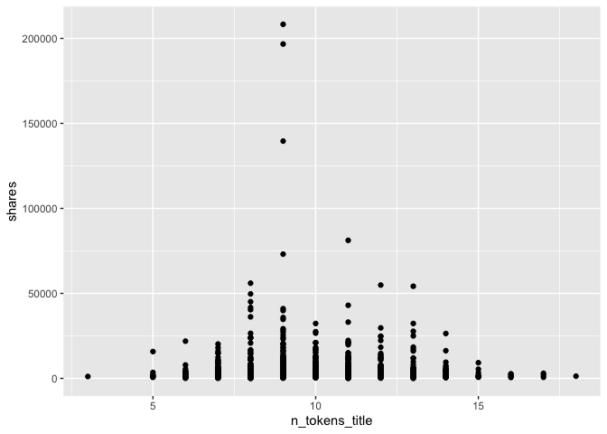

ST558 - Project 2
================
Li Wang & Bryan Bittner
2022-07-04

# Load Packages

We will use the following packages:

``` r
library(httr)
library(jsonlite)
library(readr)
library(dplyr)
library(plyr)
library(tidyr)
library(ggplot2)
library(tidyverse)
library(lubridate)
library(knitr)
```

# Introduction

This data set summarizes a heterogeneous set of features about articles
published by Mashable in a period of two years.

Our target variable is the shares variable, and predict variables are
global\_rate\_positive\_words, global\_rate\_negative\_words,
n\_tokens\_title and so on.

The purpose of our analysis is to predict the number of shares in social
networks (popularity). In this project, we produce some basic (but
meaningful) summary statistics and plots about the training data, and
fit a linear regression model and an ensemble tree-based model for
predicting the number of shares.

# Data

Use a relative path to import the data.

``` r
newsData<-read_csv(file="../ST558-Project2/OnlineNewsPopularity.csv")
head(newsData)
```

    ## # A tibble: 6 × 61
    ##   url                  timedelta n_tokens_title n_tokens_content n_unique_tokens
    ##   <chr>                    <dbl>          <dbl>            <dbl>           <dbl>
    ## 1 http://mashable.com…       731             12              219           0.664
    ## 2 http://mashable.com…       731              9              255           0.605
    ## 3 http://mashable.com…       731              9              211           0.575
    ## 4 http://mashable.com…       731              9              531           0.504
    ## 5 http://mashable.com…       731             13             1072           0.416
    ## 6 http://mashable.com…       731             10              370           0.560
    ## # … with 56 more variables: n_non_stop_words <dbl>,
    ## #   n_non_stop_unique_tokens <dbl>, num_hrefs <dbl>, num_self_hrefs <dbl>,
    ## #   num_imgs <dbl>, num_videos <dbl>, average_token_length <dbl>,
    ## #   num_keywords <dbl>, data_channel_is_lifestyle <dbl>,
    ## #   data_channel_is_entertainment <dbl>, data_channel_is_bus <dbl>,
    ## #   data_channel_is_socmed <dbl>, data_channel_is_tech <dbl>,
    ## #   data_channel_is_world <dbl>, kw_min_min <dbl>, kw_max_min <dbl>, …

Subset the data to work on the data channel of interest

``` r
#Once we parameterize this file, part of the column name will be passed in as a parameter by the render code. I'm creating a separate field to handle this portion of the column name now and eventually we can just set the parameter to this field and the rest should work.

#Parameter Name will eventually go here instead of "lifestyle"
paramColumnNameType<-"lifestyle"
columnName<-paste("data_channel_is_",paramColumnNameType,sep="")

#According to dplyr help, to refer to column names stored as string, use the '.data' pronoun.
#https://dplyr.tidyverse.org/reference/filter.html
newsDataSubset <- filter(newsData,.data[[columnName]] == 1)

# remove data_channel_is_entertainment,data_channel_is_bus, data_channel_is_socmed ,data_channel_is_tech,data_channel_is_world columns.
newsDataSubset<-newsDataSubset%>%select(-c(15:19))
head(newsDataSubset)
```

    ## # A tibble: 6 × 56
    ##   url                  timedelta n_tokens_title n_tokens_content n_unique_tokens
    ##   <chr>                    <dbl>          <dbl>            <dbl>           <dbl>
    ## 1 http://mashable.com…       731              8              960           0.418
    ## 2 http://mashable.com…       731             10              187           0.667
    ## 3 http://mashable.com…       731             11              103           0.689
    ## 4 http://mashable.com…       731             10              243           0.619
    ## 5 http://mashable.com…       731              8              204           0.586
    ## 6 http://mashable.com…       731             11              315           0.551
    ## # … with 51 more variables: n_non_stop_words <dbl>,
    ## #   n_non_stop_unique_tokens <dbl>, num_hrefs <dbl>, num_self_hrefs <dbl>,
    ## #   num_imgs <dbl>, num_videos <dbl>, average_token_length <dbl>,
    ## #   num_keywords <dbl>, data_channel_is_lifestyle <dbl>, kw_min_min <dbl>,
    ## #   kw_max_min <dbl>, kw_avg_min <dbl>, kw_min_max <dbl>, kw_max_max <dbl>,
    ## #   kw_avg_max <dbl>, kw_min_avg <dbl>, kw_max_avg <dbl>, kw_avg_avg <dbl>,
    ## #   self_reference_min_shares <dbl>, self_reference_max_shares <dbl>, …

## Summarizations

You should produce some basic (but meaningful) summary statistics and
plots about the training data you are working with (especially as it
relates to your response - aka the ‘shares’ field)

Start with the basic summary statistics for the ‘shares’ field.

``` r
summary(newsDataSubset$shares)
```

    ##    Min. 1st Qu.  Median    Mean 3rd Qu.    Max. 
    ##      28    1100    1700    3682    3250  208300

Now lets show the Mean, Median, Variance, and Standard Deviation. Notice
the Variance and Standard Deviation are both extremely high. This might
be something we will have to investigate further

``` r
newsDataSubset %>% summarise(avg = mean(shares), med = median(shares), var = var(shares), sd = sd(shares))
```

    ##        avg  med      var       sd
    ## 1 3682.123 1700 78943534 8885.017

Looking at the different columns in the dataset, there are two that
stand out. Generally speaking, people probably aren’t going to look at
articles that don’t have images or videos. Here are the summary stats
for the articles grouped on the number of images in the article.

``` r
newsDataSubset %>% group_by(num_imgs) %>%
summarise(avg = mean(shares), med = median(shares), var = var(shares), sd = sd(shares))
```

    ##        avg  med      var       sd
    ## 1 3682.123 1700 78943534 8885.017

Here are the summary stats for articles with videos.

``` r
newsDataSubset %>% group_by(num_videos) %>%
summarise(avg = mean(shares), med = median(shares), var = var(shares), sd = sd(shares))
```

    ##        avg  med      var       sd
    ## 1 3682.123 1700 78943534 8885.017

A scatter plot with the number of shares on the y-axis and
n\_tokens\_title on the x-axis is created:

``` r
g <- ggplot(newsDataSubset, aes(x = n_tokens_title, y = shares))
g + geom_point()
```

<!-- -->

# Modeling

## Random Forest Model and Explanation - Bryan

## Boosted Tree Model and Explanation - Li

## Linear Regression Explanation - Bryan

# Comparison

# Automation
