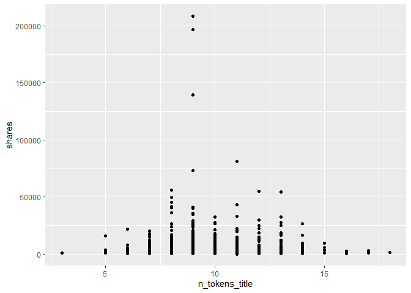

ST558 - Project 2
================
Li Wang & Bryan Bittner
2022-07-06

-   [Load Packages](#load-packages)
-   [Introduction](#introduction)
-   [Data](#data)
    -   [Summarizations](#summarizations)
-   [Modeling](#modeling)
    -   [Linear Regression Model](#linear-regression-model)
    -   [Random Forest Model](#random-forest-model)
    -   [Boosted Tree Model and Explanation -
        Li](#boosted-tree-model-and-explanation---li)
-   [Comparison](#comparison)
-   [Automation](#automation)

# Load Packages

We will use the following packages:

``` r
library(httr)
library(jsonlite)
library(readr)
library(tidyverse)
library(lubridate)
library(knitr)
library(caret)
library(randomForest)
```

# Introduction

This data set summarizes a heterogeneous set of features about articles
published by Mashable in a period of two years.

Our target variable is the shares variable, and predict variables are
global_rate_positive_words, global_rate_negative_words, n_tokens_title
and so on.

The purpose of our analysis is to predict the number of shares in social
networks (popularity). In this project, we produce some basic (but
meaningful) summary statistics and plots about the training data, and
fit a linear regression model and an ensemble tree-based model for
predicting the number of shares.

# Data

Use a relative path to import the data.

``` r
newsData<-read_csv(file="../ST558-Project2/OnlineNewsPopularity.csv")
#newsData<-read_csv(file="../Datasets/OnlineNewsPopularity.csv")
head(newsData)
```

    ## # A tibble: 6 × 61
    ##   url                timedelta n_tokens_title n_tokens_content n_unique_tokens n_non_stop_words n_non_stop_uniq… num_hrefs
    ##   <chr>                  <dbl>          <dbl>            <dbl>           <dbl>            <dbl>            <dbl>     <dbl>
    ## 1 http://mashable.c…       731             12              219           0.664             1.00            0.815         4
    ## 2 http://mashable.c…       731              9              255           0.605             1.00            0.792         3
    ## 3 http://mashable.c…       731              9              211           0.575             1.00            0.664         3
    ## 4 http://mashable.c…       731              9              531           0.504             1.00            0.666         9
    ## 5 http://mashable.c…       731             13             1072           0.416             1.00            0.541        19
    ## 6 http://mashable.c…       731             10              370           0.560             1.00            0.698         2
    ## # … with 53 more variables: num_self_hrefs <dbl>, num_imgs <dbl>, num_videos <dbl>, average_token_length <dbl>,
    ## #   num_keywords <dbl>, data_channel_is_lifestyle <dbl>, data_channel_is_entertainment <dbl>, data_channel_is_bus <dbl>,
    ## #   data_channel_is_socmed <dbl>, data_channel_is_tech <dbl>, data_channel_is_world <dbl>, kw_min_min <dbl>,
    ## #   kw_max_min <dbl>, kw_avg_min <dbl>, kw_min_max <dbl>, kw_max_max <dbl>, kw_avg_max <dbl>, kw_min_avg <dbl>,
    ## #   kw_max_avg <dbl>, kw_avg_avg <dbl>, self_reference_min_shares <dbl>, self_reference_max_shares <dbl>,
    ## #   self_reference_avg_sharess <dbl>, weekday_is_monday <dbl>, weekday_is_tuesday <dbl>, weekday_is_wednesday <dbl>,
    ## #   weekday_is_thursday <dbl>, weekday_is_friday <dbl>, weekday_is_saturday <dbl>, weekday_is_sunday <dbl>, …

Subset the data to work on the data channel of interest

``` r
#Once we parameterize this file, part of the column name will be passed in as a parameter by the render code. I'm creating a separate field to handle this portion of the column name now and eventually we can just set the parameter to this field and the rest should work.

#Parameter Name will eventually go here instead of "lifestyle"
paramColumnNameType<-"lifestyle"
columnName<-paste("data_channel_is_",paramColumnNameType,sep="")

#According to dplyr help, to refer to column names stored as string, use the '.data' pronoun.
#https://dplyr.tidyverse.org/reference/filter.html
newsDataSubset <- filter(newsData,.data[[columnName]] == 1)

# remove data_channel_is_entertainment,data_channel_is_bus, data_channel_is_socmed ,data_channel_is_tech,data_channel_is_world columns.
newsDataSubset<-newsDataSubset%>%select(-c(15:19))
head(newsDataSubset)
```

    ## # A tibble: 6 × 56
    ##   url                timedelta n_tokens_title n_tokens_content n_unique_tokens n_non_stop_words n_non_stop_uniq… num_hrefs
    ##   <chr>                  <dbl>          <dbl>            <dbl>           <dbl>            <dbl>            <dbl>     <dbl>
    ## 1 http://mashable.c…       731              8              960           0.418             1.00            0.550        21
    ## 2 http://mashable.c…       731             10              187           0.667             1.00            0.800         7
    ## 3 http://mashable.c…       731             11              103           0.689             1.00            0.806         3
    ## 4 http://mashable.c…       731             10              243           0.619             1.00            0.824         1
    ## 5 http://mashable.c…       731              8              204           0.586             1.00            0.698         7
    ## 6 http://mashable.c…       731             11              315           0.551             1.00            0.702         4
    ## # … with 48 more variables: num_self_hrefs <dbl>, num_imgs <dbl>, num_videos <dbl>, average_token_length <dbl>,
    ## #   num_keywords <dbl>, data_channel_is_lifestyle <dbl>, kw_min_min <dbl>, kw_max_min <dbl>, kw_avg_min <dbl>,
    ## #   kw_min_max <dbl>, kw_max_max <dbl>, kw_avg_max <dbl>, kw_min_avg <dbl>, kw_max_avg <dbl>, kw_avg_avg <dbl>,
    ## #   self_reference_min_shares <dbl>, self_reference_max_shares <dbl>, self_reference_avg_sharess <dbl>,
    ## #   weekday_is_monday <dbl>, weekday_is_tuesday <dbl>, weekday_is_wednesday <dbl>, weekday_is_thursday <dbl>,
    ## #   weekday_is_friday <dbl>, weekday_is_saturday <dbl>, weekday_is_sunday <dbl>, is_weekend <dbl>, LDA_00 <dbl>,
    ## #   LDA_01 <dbl>, LDA_02 <dbl>, LDA_03 <dbl>, LDA_04 <dbl>, global_subjectivity <dbl>, global_sentiment_polarity <dbl>, …

## Summarizations

You should produce some basic (but meaningful) summary statistics and
plots about the training data you are working with (especially as it
relates to your response - aka the ‘shares’ field)

Start with the basic summary statistics for the ‘shares’ field.

``` r
summary(newsDataSubset$shares)
```

    ##    Min. 1st Qu.  Median    Mean 3rd Qu.    Max. 
    ##      28    1100    1700    3682    3250  208300

Now lets show the Mean, Median, Variance, and Standard Deviation. Notice
the Variance and Standard Deviation are both extremely high. This might
be something we will have to investigate further

``` r
newsDataSubset %>% summarise(avg = mean(shares), med = median(shares), var = var(shares), sd = sd(shares))
```

    ##        avg  med      var       sd
    ## 1 3682.123 1700 78943534 8885.017

Looking at the different columns in the dataset, there are two that
stand out. Generally speaking, people probably aren’t going to look at
articles that don’t have images or videos. Here are the summary stats
for the articles grouped on the number of images in the article.

``` r
newsDataSubset %>% group_by(num_imgs) %>%
summarise(avg = mean(shares), med = median(shares), var = var(shares), sd = sd(shares))
```

    ##        avg  med      var       sd
    ## 1 3682.123 1700 78943534 8885.017

Here are the summary stats for articles with videos.

``` r
newsDataSubset %>% group_by(num_videos) %>%
summarise(avg = mean(shares), med = median(shares), var = var(shares), sd = sd(shares))
```

    ##        avg  med      var       sd
    ## 1 3682.123 1700 78943534 8885.017

A scatter plot with the number of shares on the y-axis and
n_tokens_title on the x-axis is created:

``` r
g <- ggplot(newsDataSubset, aes(x = n_tokens_title, y = shares))
g + geom_point()
```

<!-- -->

# Modeling

Before we do any modeling, lets set up our Train/Test split. This will
allow us to determine the model fit using a subset of data called
Training, while saving the remainder of the data called Test to test our
model predictions with.

``` r
set.seed(10)
train <- sample(1:nrow(newsDataSubset),size=nrow(newsDataSubset)*.7)
test <- dplyr::setdiff(1:nrow(newsDataSubset),train)

newsDataSubsetTrain <- newsDataSubset[train,]
newsDataSubsetTest <- newsDataSubset[test,]

head(newsDataSubsetTrain)
```

    ## # A tibble: 6 × 56
    ##   url                timedelta n_tokens_title n_tokens_content n_unique_tokens n_non_stop_words n_non_stop_uniq… num_hrefs
    ##   <chr>                  <dbl>          <dbl>            <dbl>           <dbl>            <dbl>            <dbl>     <dbl>
    ## 1 http://mashable.c…       622             11              308           0.564             1.00            0.728         8
    ## 2 http://mashable.c…       652              9              457           0.494             1.00            0.688         5
    ## 3 http://mashable.c…       235             14              121           0.783             1.00            0.929         6
    ## 4 http://mashable.c…       192             12              823           0.447             1.00            0.602        10
    ## 5 http://mashable.c…       243             10             1316           0.426             1.00            0.614        14
    ## 6 http://mashable.c…       152             12              691           0.423             1.00            0.613        15
    ## # … with 48 more variables: num_self_hrefs <dbl>, num_imgs <dbl>, num_videos <dbl>, average_token_length <dbl>,
    ## #   num_keywords <dbl>, data_channel_is_lifestyle <dbl>, kw_min_min <dbl>, kw_max_min <dbl>, kw_avg_min <dbl>,
    ## #   kw_min_max <dbl>, kw_max_max <dbl>, kw_avg_max <dbl>, kw_min_avg <dbl>, kw_max_avg <dbl>, kw_avg_avg <dbl>,
    ## #   self_reference_min_shares <dbl>, self_reference_max_shares <dbl>, self_reference_avg_sharess <dbl>,
    ## #   weekday_is_monday <dbl>, weekday_is_tuesday <dbl>, weekday_is_wednesday <dbl>, weekday_is_thursday <dbl>,
    ## #   weekday_is_friday <dbl>, weekday_is_saturday <dbl>, weekday_is_sunday <dbl>, is_weekend <dbl>, LDA_00 <dbl>,
    ## #   LDA_01 <dbl>, LDA_02 <dbl>, LDA_03 <dbl>, LDA_04 <dbl>, global_subjectivity <dbl>, global_sentiment_polarity <dbl>, …

## Linear Regression Model

A Linear Regression Model is the first model type we will look at. These
models are an intuitive way to investigate the linear relation between
multiple variables. These models make the estimation procedure simple
and easy to understand. Linear Regression models can come in all
different shapes and sizes and can be used to model more than just a
straight linear relationship. Regression models can be modified with
interactive and or higher order terms that will conform to a more
complex relationship.

For the first linear model example, we can try a model using just the
“num_imgs” and “num_videos” as our predictors.

``` r
#Fit a  multiple linear regression model with Temperature and Season
mlrFit <- train(shares ~ num_imgs + num_videos, 
                data = newsDataSubsetTrain, 
                method="lm",
                trControl=trainControl(method="cv",number=5))
mlrFit
```

    ## Linear Regression 
    ## 
    ## 1469 samples
    ##    2 predictor
    ## 
    ## No pre-processing
    ## Resampling: Cross-Validated (5 fold) 
    ## Summary of sample sizes: 1176, 1174, 1176, 1174, 1176 
    ## Resampling results:
    ## 
    ##   RMSE      Rsquared     MAE     
    ##   8515.114  0.003603234  3287.381
    ## 
    ## Tuning parameter 'intercept' was held constant at a value of TRUE

Next we can try a linear model using all of the fields as a predictor
variables.

``` r
#Fit a  multiple linear regression model with Temperature and Season
mlrAllFit <- train(shares ~ ., 
                data = newsDataSubsetTrain, 
                method="lm",
                trControl=trainControl(method="cv",number=5))
mlrAllFit
```

    ## Linear Regression 
    ## 
    ## 1469 samples
    ##   55 predictor
    ## 
    ## No pre-processing
    ## Resampling: Cross-Validated (5 fold) 
    ## Summary of sample sizes: 1174, 1177, 1175, 1175, 1175 
    ## Resampling results:
    ## 
    ##   RMSE      Rsquared  MAE     
    ##   9004.098  NaN       3001.381
    ## 
    ## Tuning parameter 'intercept' was held constant at a value of TRUE

## Random Forest Model

The Random Forest Model is an example of an ensemble based model.
Instead of traditional decision trees, ensemble methods average across
the tree. This will greatly increase our prediction power, but it will
come at the expense of the easy interpretation from traditional decision
trees. The Random Forest based model will not use all available
predictors. Instead it will take a random subset of the predictors for
each tree fit and calculate the model fit for that subset. It will
repeat the process a pre-determined number of times and automatically
pick the best predictors for the model. This will end up creating a
reduction in the overall model variance.

``` r
#Regression Tree so use mtry=# predictors/3
randomForestFit <- train(shares ~ ., 
                         data = newsDataSubsetTrain, 
                         method="rf",
                         preProcess=c("center","scale"),
                         trControl=trainControl(method="cv",number=5),
                         tuneGrid=data.frame(mtry=ncol(newsDataSubsetTrain)/3))
randomForestFit
```

    ## Random Forest 
    ## 
    ## 1469 samples
    ##   55 predictor
    ## 
    ## Pre-processing: centered (1522), scaled (1522) 
    ## Resampling: Cross-Validated (5 fold) 
    ## Summary of sample sizes: 1174, 1176, 1175, 1175, 1176 
    ## Resampling results:
    ## 
    ##   RMSE      Rsquared    MAE     
    ##   7879.523  0.01318217  3160.918
    ## 
    ## Tuning parameter 'mtry' was held constant at a value of 18.66667

Random Forest - Confusion Matrix

``` r
#confusionMatrix(data=newsDataSubsetTest$shares, reference=predict(randomForestFit,newdata=newsDataSubsetTest))
```

## Boosted Tree Model and Explanation - Li

# Comparison

# Automation
