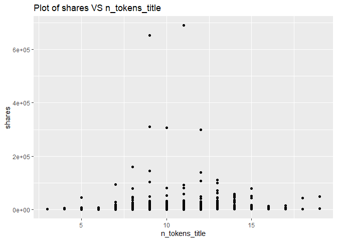
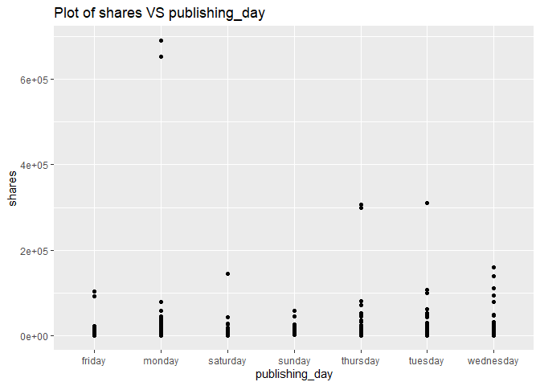
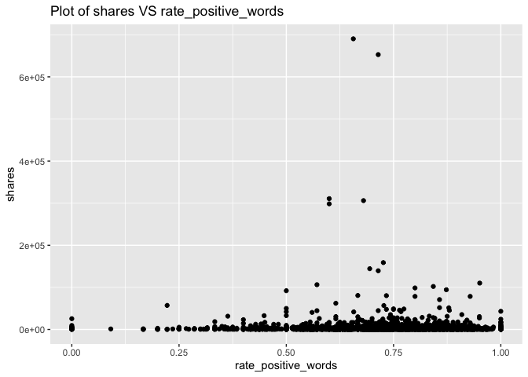
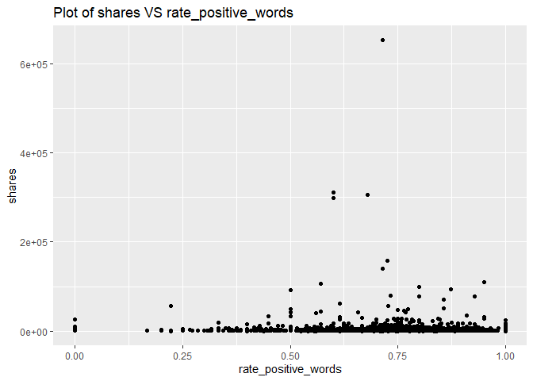
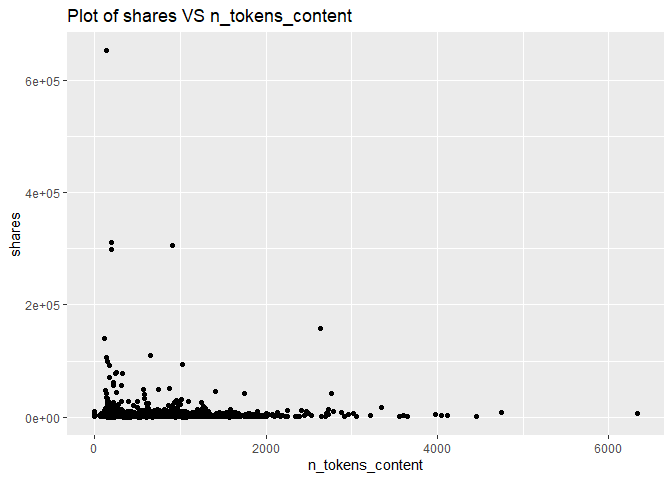
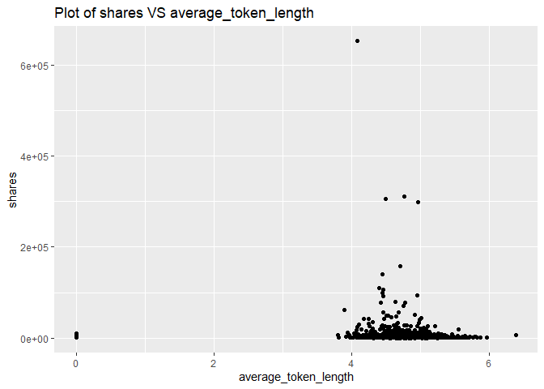

ST558 - Project 2
================
Li Wang & Bryan Bittner
2022-07-08

-   [Load Packages](#load-packages)
-   [Introduction](#introduction)
-   [Data](#data)
    -   [Summarizations](#summarizations)
-   [Modeling](#modeling)
    -   [Linear Regression Model](#linear-regression-model)
    -   [Random Forest Model](#random-forest-model)
    -   [Boosted Tree Model](#boosted-tree-model)
-   [Comparison](#comparison)
-   [Automation](#automation)

``` r
rmarkdown::render("Project2.Rmd", 
                  output_format = "github_document",
                  output_file = "README.md",
                  output_options = list(html_preview= FALSE,toc=TRUE,toc_depth=2,toc_float=TRUE)
)
```

# Load Packages

We will use the following packages:

``` r
library(rmarkdown)
library(httr)
library(jsonlite)
library(readr)
library(tidyverse)
library(lubridate)
library(knitr)
library(caret)
library(randomForest)
library(corrplot)
library(gbm)
```

# Introduction

This data set summarizes a heterogeneous set of features about articles
published by Mashable in a period of two years.

Our target variable is the shares variable, and predict variables are
the following:

publishing_day: Day of the article published n_tokens_title: Number of
words in the title n_tokens_content: Number of words in the content
num_self_hrefs: Number of links to other articles published by Mashable
num_imgs: Number of images num_videos: Number of videos
average_token_length: Average length of the words in the content
num_keywords: Number of keywords in the metadata kw_avg_min: Worst
keyword (avg. shares) kw_avg_avg: Avg. keyword (avg. shares)
self_reference_avg_shares: Avg. shares of referenced articles in
Mashable LDA_04: Closeness to LDA topic 4 global_subjectivity: ext
subjectivity global_rate_positive_words: Rate of positive words in the
content rate_positive_words: Rate of positive words among non-neutral
tokens avg_positive_polarity: Avg. polarity of positive words
min_positive_polarity: Min. polarity of positive words
avg_negative_polarity: Avg. polarity of negative words
max_negative_polarity: Max. polarity of negative words
title_subjectivity: Title subjectivity

The purpose of our analysis is to predict the number of shares in social
networks (popularity). In this project, we produce some basic (but
meaningful) summary statistics and plots about the training data, and
fit a linear regression model and an ensemble tree-based model for
predicting the number of shares.

# Data

Use a relative path to import the data.

``` r
newsData<-read_csv(file="../Datasets/OnlineNewsPopularity.csv")
head(newsData)
```

    ## # A tibble: 6 × 61
    ##   url                timedelta n_tokens_title n_tokens_content n_unique_tokens n_non_stop_words n_non_stop_uniq… num_hrefs
    ##   <chr>                  <dbl>          <dbl>            <dbl>           <dbl>            <dbl>            <dbl>     <dbl>
    ## 1 http://mashable.c…       731             12              219           0.664             1.00            0.815         4
    ## 2 http://mashable.c…       731              9              255           0.605             1.00            0.792         3
    ## 3 http://mashable.c…       731              9              211           0.575             1.00            0.664         3
    ## 4 http://mashable.c…       731              9              531           0.504             1.00            0.666         9
    ## 5 http://mashable.c…       731             13             1072           0.416             1.00            0.541        19
    ## 6 http://mashable.c…       731             10              370           0.560             1.00            0.698         2
    ## # … with 53 more variables: num_self_hrefs <dbl>, num_imgs <dbl>, num_videos <dbl>, average_token_length <dbl>,
    ## #   num_keywords <dbl>, data_channel_is_lifestyle <dbl>, data_channel_is_entertainment <dbl>, data_channel_is_bus <dbl>,
    ## #   data_channel_is_socmed <dbl>, data_channel_is_tech <dbl>, data_channel_is_world <dbl>, kw_min_min <dbl>,
    ## #   kw_max_min <dbl>, kw_avg_min <dbl>, kw_min_max <dbl>, kw_max_max <dbl>, kw_avg_max <dbl>, kw_min_avg <dbl>,
    ## #   kw_max_avg <dbl>, kw_avg_avg <dbl>, self_reference_min_shares <dbl>, self_reference_max_shares <dbl>,
    ## #   self_reference_avg_sharess <dbl>, weekday_is_monday <dbl>, weekday_is_tuesday <dbl>, weekday_is_wednesday <dbl>,
    ## #   weekday_is_thursday <dbl>, weekday_is_friday <dbl>, weekday_is_saturday <dbl>, weekday_is_sunday <dbl>, …

Subset the data. If running the reports by an automated parameter driven
process, the report will automatically use the parameter passed into
this report. If running the report manually without a parameter, the
data will subset to the ‘lifestyle’ news channel.

``` r
#Read the parameter being passed in to the automated report
if (params$columnNames != "") {
  paramColumnNameType<-params$columnNames
}else{
  paramColumnNameType<-"lifestyle"
}

columnName<-paste("data_channel_is_",paramColumnNameType,sep="")

#According to dplyr help, to refer to column names stored as string, use the '.data' pronoun.
#https://dplyr.tidyverse.org/reference/filter.html
newsDataSubset <- filter(newsData,.data[[columnName]] == 1)
```

Merging the weekdays columns channels as one single column named
publishing_day.

``` r
# Merging the weekdays columns channels as one single column named publishing_day
newsDataSubset <- newsDataSubset %>%
  select(url, starts_with("weekday_is")) %>%
  pivot_longer(-url) %>%
  dplyr::filter(value > 0) %>%
  mutate(publishing_day = gsub("weekday_is_", "", name)) %>%
  left_join(newsDataSubset, by = "url") %>%
  select(-name, -starts_with("weekday_is_"))

# set the publishing_day as factor variable
newsDataSubset$publishing_day<- as.factor(newsDataSubset$publishing_day)
head(newsDataSubset)
```

    ## # A tibble: 6 × 56
    ##   url     value publishing_day timedelta n_tokens_title n_tokens_content n_unique_tokens n_non_stop_words n_non_stop_uniq…
    ##   <chr>   <dbl> <fct>              <dbl>          <dbl>            <dbl>           <dbl>            <dbl>            <dbl>
    ## 1 http:/…     1 monday               731              9              255           0.605             1.00            0.792
    ## 2 http:/…     1 monday               731              9              211           0.575             1.00            0.664
    ## 3 http:/…     1 monday               731              8              397           0.625             1.00            0.806
    ## 4 http:/…     1 monday               731             13              244           0.560             1.00            0.680
    ## 5 http:/…     1 monday               731             11              723           0.491             1.00            0.642
    ## 6 http:/…     1 monday               731              8              708           0.482             1.00            0.688
    ## # … with 47 more variables: num_hrefs <dbl>, num_self_hrefs <dbl>, num_imgs <dbl>, num_videos <dbl>,
    ## #   average_token_length <dbl>, num_keywords <dbl>, data_channel_is_lifestyle <dbl>, data_channel_is_entertainment <dbl>,
    ## #   data_channel_is_bus <dbl>, data_channel_is_socmed <dbl>, data_channel_is_tech <dbl>, data_channel_is_world <dbl>,
    ## #   kw_min_min <dbl>, kw_max_min <dbl>, kw_avg_min <dbl>, kw_min_max <dbl>, kw_max_max <dbl>, kw_avg_max <dbl>,
    ## #   kw_min_avg <dbl>, kw_max_avg <dbl>, kw_avg_avg <dbl>, self_reference_min_shares <dbl>,
    ## #   self_reference_max_shares <dbl>, self_reference_avg_sharess <dbl>, is_weekend <dbl>, LDA_00 <dbl>, LDA_01 <dbl>,
    ## #   LDA_02 <dbl>, LDA_03 <dbl>, LDA_04 <dbl>, global_subjectivity <dbl>, global_sentiment_polarity <dbl>, …

Here we drop some non-preditive variables:
url,value,timedelta,data_channel_is_lifestyle,
data_channel_is_entertainment,data_channel_is_bus,
data_channel_is_socmed ,data_channel_is_tech,data_channel_is_world
columns,is_weekend. They won’t contribute anything.

``` r
newsDataSubset<-newsDataSubset%>%select(-c(1,2,4,16:21,34))
newsDataSubset
```

    ## # A tibble: 6,258 × 46
    ##    publishing_day n_tokens_title n_tokens_content n_unique_tokens n_non_stop_words n_non_stop_unique_tokens num_hrefs
    ##    <fct>                   <dbl>            <dbl>           <dbl>            <dbl>                    <dbl>     <dbl>
    ##  1 monday                      9              255           0.605             1.00                    0.792         3
    ##  2 monday                      9              211           0.575             1.00                    0.664         3
    ##  3 monday                      8              397           0.625             1.00                    0.806        11
    ##  4 monday                     13              244           0.560             1.00                    0.680         3
    ##  5 monday                     11              723           0.491             1.00                    0.642        18
    ##  6 monday                      8              708           0.482             1.00                    0.688         8
    ##  7 monday                     10              142           0.655             1.00                    0.792         2
    ##  8 monday                     12              444           0.601             1.00                    0.755         9
    ##  9 monday                      6              109           0.667             1.00                    0.737         3
    ## 10 tuesday                    13              306           0.535             1.00                    0.705         3
    ## # … with 6,248 more rows, and 39 more variables: num_self_hrefs <dbl>, num_imgs <dbl>, num_videos <dbl>,
    ## #   average_token_length <dbl>, num_keywords <dbl>, kw_min_min <dbl>, kw_max_min <dbl>, kw_avg_min <dbl>,
    ## #   kw_min_max <dbl>, kw_max_max <dbl>, kw_avg_max <dbl>, kw_min_avg <dbl>, kw_max_avg <dbl>, kw_avg_avg <dbl>,
    ## #   self_reference_min_shares <dbl>, self_reference_max_shares <dbl>, self_reference_avg_sharess <dbl>, LDA_00 <dbl>,
    ## #   LDA_01 <dbl>, LDA_02 <dbl>, LDA_03 <dbl>, LDA_04 <dbl>, global_subjectivity <dbl>, global_sentiment_polarity <dbl>,
    ## #   global_rate_positive_words <dbl>, global_rate_negative_words <dbl>, rate_positive_words <dbl>,
    ## #   rate_negative_words <dbl>, avg_positive_polarity <dbl>, min_positive_polarity <dbl>, max_positive_polarity <dbl>, …

## Summarizations

Start with the data structure and basic summary statistics for the
‘shares’ field.

``` r
# data structure
str(newsDataSubset)
```

    ## tibble [6,258 × 46] (S3: tbl_df/tbl/data.frame)
    ##  $ publishing_day              : Factor w/ 7 levels "friday","monday",..: 2 2 2 2 2 2 2 2 2 6 ...
    ##  $ n_tokens_title              : num [1:6258] 9 9 8 13 11 8 10 12 6 13 ...
    ##  $ n_tokens_content            : num [1:6258] 255 211 397 244 723 708 142 444 109 306 ...
    ##  $ n_unique_tokens             : num [1:6258] 0.605 0.575 0.625 0.56 0.491 ...
    ##  $ n_non_stop_words            : num [1:6258] 1 1 1 1 1 ...
    ##  $ n_non_stop_unique_tokens    : num [1:6258] 0.792 0.664 0.806 0.68 0.642 ...
    ##  $ num_hrefs                   : num [1:6258] 3 3 11 3 18 8 2 9 3 3 ...
    ##  $ num_self_hrefs              : num [1:6258] 1 1 0 2 1 3 1 8 2 2 ...
    ##  $ num_imgs                    : num [1:6258] 1 1 1 1 1 1 1 23 1 1 ...
    ##  $ num_videos                  : num [1:6258] 0 0 0 0 0 1 0 0 0 0 ...
    ##  $ average_token_length        : num [1:6258] 4.91 4.39 5.45 4.42 5.23 ...
    ##  $ num_keywords                : num [1:6258] 4 6 6 4 6 7 5 10 6 10 ...
    ##  $ kw_min_min                  : num [1:6258] 0 0 0 0 0 0 0 0 0 217 ...
    ##  $ kw_max_min                  : num [1:6258] 0 0 0 0 0 0 0 0 0 5700 ...
    ##  $ kw_avg_min                  : num [1:6258] 0 0 0 0 0 ...
    ##  $ kw_min_max                  : num [1:6258] 0 0 0 0 0 0 0 0 0 0 ...
    ##  $ kw_max_max                  : num [1:6258] 0 0 0 0 0 0 0 0 0 17100 ...
    ##  $ kw_avg_max                  : num [1:6258] 0 0 0 0 0 ...
    ##  $ kw_min_avg                  : num [1:6258] 0 0 0 0 0 0 0 0 0 0 ...
    ##  $ kw_max_avg                  : num [1:6258] 0 0 0 0 0 0 0 0 0 5700 ...
    ##  $ kw_avg_avg                  : num [1:6258] 0 0 0 0 0 ...
    ##  $ self_reference_min_shares   : num [1:6258] 0 918 0 2800 0 6100 0 585 821 0 ...
    ##  $ self_reference_max_shares   : num [1:6258] 0 918 0 2800 0 6100 0 1600 821 0 ...
    ##  $ self_reference_avg_sharess  : num [1:6258] 0 918 0 2800 0 ...
    ##  $ LDA_00                      : num [1:6258] 0.8 0.218 0.867 0.3 0.867 ...
    ##  $ LDA_01                      : num [1:6258] 0.05 0.0333 0.0333 0.05 0.0333 ...
    ##  $ LDA_02                      : num [1:6258] 0.0501 0.0334 0.0333 0.05 0.0333 ...
    ##  $ LDA_03                      : num [1:6258] 0.0501 0.0333 0.0333 0.05 0.0333 ...
    ##  $ LDA_04                      : num [1:6258] 0.05 0.6822 0.0333 0.5497 0.0333 ...
    ##  $ global_subjectivity         : num [1:6258] 0.341 0.702 0.374 0.332 0.375 ...
    ##  $ global_sentiment_polarity   : num [1:6258] 0.1489 0.3233 0.2125 -0.0923 0.1827 ...
    ##  $ global_rate_positive_words  : num [1:6258] 0.0431 0.0569 0.0655 0.0164 0.0636 ...
    ##  $ global_rate_negative_words  : num [1:6258] 0.01569 0.00948 0.01008 0.02459 0.0083 ...
    ##  $ rate_positive_words         : num [1:6258] 0.733 0.857 0.867 0.4 0.885 ...
    ##  $ rate_negative_words         : num [1:6258] 0.267 0.143 0.133 0.6 0.115 ...
    ##  $ avg_positive_polarity       : num [1:6258] 0.287 0.496 0.382 0.292 0.341 ...
    ##  $ min_positive_polarity       : num [1:6258] 0.0333 0.1 0.0333 0.1364 0.0333 ...
    ##  $ max_positive_polarity       : num [1:6258] 0.7 1 1 0.433 1 ...
    ##  $ avg_negative_polarity       : num [1:6258] -0.119 -0.467 -0.145 -0.456 -0.214 ...
    ##  $ min_negative_polarity       : num [1:6258] -0.125 -0.8 -0.2 -1 -0.6 -0.5 -0.3 0 -0.1 0 ...
    ##  $ max_negative_polarity       : num [1:6258] -0.1 -0.133 -0.1 -0.125 -0.1 ...
    ##  $ title_subjectivity          : num [1:6258] 0 0 0 0.7 0.5 ...
    ##  $ title_sentiment_polarity    : num [1:6258] 0 0 0 -0.4 0.5 ...
    ##  $ abs_title_subjectivity      : num [1:6258] 0.5 0.5 0.5 0.2 0 ...
    ##  $ abs_title_sentiment_polarity: num [1:6258] 0 0 0 0.4 0.5 ...
    ##  $ shares                      : num [1:6258] 711 1500 3100 852 425 3200 575 819 732 1200 ...

``` r
# data summary
summary(newsDataSubset$shares)
```

    ##     Min.  1st Qu.   Median     Mean  3rd Qu.     Max. 
    ##      1.0    952.2   1400.0   3063.0   2500.0 690400.0

Now lets show the Mean, Median, Variance, and Standard Deviation. Notice
the Variance and Standard Deviation are both extremely high. This might
be something we will have to investigate further.

``` r
newsDataSubset %>% summarise(avg = mean(shares), med = median(shares), var = var(shares), sd = sd(shares))
```

    ## # A tibble: 1 × 4
    ##     avg   med        var     sd
    ##   <dbl> <dbl>      <dbl>  <dbl>
    ## 1 3063.  1400 226393781. 15046.

Looking at the different columns in the dataset, there are two that
stand out. Generally speaking, people probably aren’t going to look at
articles that don’t have images or videos. Here are the summary stats
for the articles grouped on the number of images in the article.

``` r
newsDataSubset %>% group_by(num_imgs) %>%
summarise(avg = mean(shares), med = median(shares), var = var(shares), sd = sd(shares))
```

    ## # A tibble: 39 × 5
    ##    num_imgs   avg   med         var     sd
    ##       <dbl> <dbl> <dbl>       <dbl>  <dbl>
    ##  1        0 6493.  1400 1457115708. 38172.
    ##  2        1 2340.  1300   26257637.  5124.
    ##  3        2 2450.  1500   11991405.  3463.
    ##  4        3 3261.  2100   20513208.  4529.
    ##  5        4 3068.  2450    5680011.  2383.
    ##  6        5 5440   3400   23042500   4800.
    ##  7        6 3556.  2900   14355208.  3789.
    ##  8        7 3352.  2400   10163714.  3188.
    ##  9        8 3545.  2200   11014302.  3319.
    ## 10        9 3544.  1900    9612828.  3100.
    ## # … with 29 more rows

As we can see from the above table, the largest avg of shares is with 27
images, and the least avg of shares is with 23 images. Therefore, the
number of images variable is affect shares, we will keep this variable.

Here are the summary stats for articles with videos.

``` r
newsDataSubset %>% group_by(num_videos) %>%
summarise(avg = mean(shares), med = median(shares), var = var(shares), sd = sd(shares))
```

    ## # A tibble: 29 × 5
    ##    num_videos    avg   med         var     sd
    ##         <dbl>  <dbl> <dbl>       <dbl>  <dbl>
    ##  1          0  2354.  1300   37755750.  6145.
    ##  2          1  4212.  1600  197246337. 14044.
    ##  3          2 11545.  1900 3099395785. 55672.
    ##  4          3  3089.  1900    9974423.  3158.
    ##  5          4  2445.  1700    7157730.  2675.
    ##  6          5  2147.  1800    1392905.  1180.
    ##  7          6  2556.  1400    6955071.  2637.
    ##  8          7  2131.  1600    1999643.  1414.
    ##  9          8  3900.  1750   23882668.  4887.
    ## 10          9  9338   9338  146615688  12108.
    ## # … with 19 more rows

As we can see from the above table, the largest avg of shares is with 15
videos, and the least avg of shares is with 28 videos Therefore, the
number of videos variable is affect shares, we will keep this variable.

A plot with the number of shares on the y-axis and n_tokens_title on the
x-axis is created:

``` r
g <- ggplot(newsDataSubset, aes(x = n_tokens_title, y = shares))
g + geom_point()+labs(title = "Plot of shares VS n_tokens_title")
```

<!-- -->

From the above plot, we can see that the most shares is with 6-15 words
in the title. Therefore, we will keep n_tokens_title variable.

A plot with the number of shares on the y-axis and publishing_day on the
x-axis is created:

``` r
g <- ggplot(newsDataSubset, aes(x = publishing_day, y = shares))
g + geom_point()+labs(title = "Plot of shares VS publishing_day")
```

<!-- -->

From the above plot, we can see that the best popular articles are
usually posted on Monday, Tuesday, and Wednesday. Articles is less
popularity which are published on Sunday and Saturday. Therefore, we
will keep publishing_day.

A plot with the number of shares on the y-axis and rate_positive_words
on the x-axis is created:

``` r
g <- ggplot(newsDataSubset, aes(x = rate_positive_words, y = shares))
g + geom_point()+labs(title = "Plot of shares VS rate_positive_words")
```

<!-- -->

From the above plot, we can see that the best popular articles are with
0.5-0.9 rate_positive_words. Therefore, the variable rate_positive_words
effect to shares, we will keep this variable.

A plot with the number of shares on the y-axis and n_tokens_content on
the x-axis is created:

``` r
g <- ggplot(newsDataSubset, aes(x = n_tokens_content, y = shares))
g + geom_point()+labs(title = "Plot of shares VS n_tokens_content")
```

<!-- -->

From the above plot, we can see that the number of words in the article
less than 1500 words are with good shares. The lesser the better.
Therefore, the variable n_tokens_content effect to shares, we will keep
this variable.

A plot with the number of shares on the y-axis and average_token_length
on the x-axis is created:

``` r
g <- ggplot(newsDataSubset, aes(x = average_token_length, y = shares))
g + geom_point()+labs(title = "Plot of shares VS average_token_length")
```

<!-- -->

From the above plot, we can see that the almost shares are with 4-6
length word. Therefore, the variable average_token_length effect to
shares, we will keep this variable.

Correlation matrix plot is generated:

``` r
newsDataSubset1<-select(newsDataSubset,-publishing_day)
corr=cor(newsDataSubset1, method = c("spearman"))
corrplot(corr,tl.cex=0.5)
```

<!-- -->

By the above correlation matrix plot, we can see these variables are
strongly correlated:

-   title_subjectivity, abs_title_sentiment_polarity,
    abs_title_subjectivity, title_sentiment_polarity
-   avg_negative_polarity, min_negative_polarity
-   max_positive_polarity, avg_positive_polarity
-   global_rate_negative_words, rate_negative_words,rate_positive_words
-   global_sentiment_polarity, rate_negative_words, rate_positive_words
-   LDA_03,LDA_04
-   LDA_00,LDA_04
-   self_reference_max_shares, self_reference_avg_shares,
    self_reference_min_shares
-   kw_max_avg, kw_avg_avg
-   kw_min_avg,kw_avg_avg,kw_min_max
-   kw_avg_max,kw_avg_avg,kw_max_max
-   kw_avg_min,kw_avg_max
-   kw_max_min,kw_avg_min,kw_min_min
-   kw_min_min,kw_avg_max
-   num_keywords,LDA_01
-   num_keywords,LDA_02
-   num_hrefs, num_imgs
-   n_non_stop_unique_tokens, num_imgs
-   n_non_stop_words, n_non_stop_unique_tokens
-   n_unique_tokens,n_non_stop_unique_tokens
-   n_unique_tokens, n_non_stop_words, n_tokens_content
-   n_tokens_content, n_non_stop_unique_tokens
-   n_tokens_content, num_hrefs

These are strongly correlated and linearly dependent which makes us to
assume that these features are so linearly dependent that any one of the
strong correlated feature can be used and excluding the other features
won’t affect the model and will be indirectly helpful in our model by
not allowing to do overfitting.

Let’s do feature selection:

``` r
newsDataSubset2<-select(newsDataSubset,-abs_title_sentiment_polarity, -abs_title_subjectivity, -title_sentiment_polarity,-min_negative_polarity,-max_positive_polarity,-rate_negative_words,-global_rate_negative_words,-global_sentiment_polarity,-LDA_03,-LDA_00,-self_reference_max_shares,-self_reference_min_shares,-kw_max_avg,-kw_min_avg,-kw_min_max,-kw_avg_max,-kw_max_max,-kw_max_min,-kw_min_min,-LDA_01,-LDA_02,-num_hrefs,-n_non_stop_unique_tokens,-n_unique_tokens,-n_non_stop_words)
```

# Modeling

Before we do any modeling, lets set up our Train/Test split. This will
allow us to determine the model fit using a subset of data called
Training, while saving the remainder of the data called Test to test our
model predictions with.

``` r
set.seed(111)
train <- sample(1:nrow(newsDataSubset2),size=nrow(newsDataSubset2)*0.7)
test <- dplyr::setdiff(1:nrow(newsDataSubset2),train)

newsDataSubsetTrain <- newsDataSubset2[train,]
newsDataSubsetTest <- newsDataSubset2[test,]
```

## Linear Regression Model

A Linear Regression Model is the first model type we will look at. These
models are an intuitive way to investigate the linear relation between
multiple variables. These models make the estimation procedure simple
and easy to understand. Linear Regression models can come in all
different shapes and sizes and can be used to model more than just a
straight linear relationship. Regression models can be modified with
interactive and or higher order terms that will conform to a more
complex relationship.

For the first linear model example, we can try a model using just the
“num_imgs” and “num_videos” as our predictors.

``` r
set.seed(111)
#Fit a  multiple linear regression model using just the "num_imgs" and "num_videos" as our predictors. 
mlrFit <- train(shares ~ num_imgs + num_videos, 
                data = newsDataSubsetTrain, 
                method="lm",
                trControl=trainControl(method="cv",number=5))
mlrFit
```

    ## Linear Regression 
    ## 
    ## 4380 samples
    ##    2 predictor
    ## 
    ## No pre-processing
    ## Resampling: Cross-Validated (5 fold) 
    ## Summary of sample sizes: 3504, 3504, 3505, 3503, 3504 
    ## Resampling results:
    ## 
    ##   RMSE      Rsquared     MAE     
    ##   12776.13  0.001289906  2755.481
    ## 
    ## Tuning parameter 'intercept' was held constant at a value of TRUE

Next we can try a linear model using all of the fields as a predictor
variables.

``` r
#Fit a  multiple linear regression model using all of the fields as a predictor variables.
set.seed(111)
mlrAllFit <- train(shares ~ ., 
                data = newsDataSubsetTrain, 
                method="lm",
                trControl=trainControl(method="cv",number=5))
mlrAllFit
```

    ## Linear Regression 
    ## 
    ## 4380 samples
    ##   20 predictor
    ## 
    ## No pre-processing
    ## Resampling: Cross-Validated (5 fold) 
    ## Summary of sample sizes: 3504, 3504, 3505, 3503, 3504 
    ## Resampling results:
    ## 
    ##   RMSE      Rsquared    MAE     
    ##   13004.96  0.02711116  2925.365
    ## 
    ## Tuning parameter 'intercept' was held constant at a value of TRUE

Try a model using just the num_imgs + num_videos + kw_avg_avg +
num_imgs\*kw_avg_avg as our predictors.

``` r
set.seed(111)
#Fit a  multiple linear regression model with num_imgs + num_videos + kw_avg_avg + num_imgs*kw_avg_avg. 
mlrInteractionFit <- train(shares ~ num_imgs + num_videos + kw_avg_avg + num_imgs*kw_avg_avg, 
                data = newsDataSubsetTrain, 
                method="lm",
                trControl=trainControl(method="cv",number=5))
mlrInteractionFit
```

    ## Linear Regression 
    ## 
    ## 4380 samples
    ##    3 predictor
    ## 
    ## No pre-processing
    ## Resampling: Cross-Validated (5 fold) 
    ## Summary of sample sizes: 3504, 3504, 3505, 3503, 3504 
    ## Resampling results:
    ## 
    ##   RMSE     Rsquared     MAE     
    ##   12772.3  0.008891269  2695.487
    ## 
    ## Tuning parameter 'intercept' was held constant at a value of TRUE

## Random Forest Model

The Random Forest Model is an example of an ensemble based model.
Instead of traditional decision trees, ensemble methods average across
the tree. This will greatly increase our prediction power, but it will
come at the expense of the easy interpretation from traditional decision
trees. The Random Forest based model will not use all available
predictors. Instead it will take a random subset of the predictors for
each tree fit and calculate the model fit for that subset. It will
repeat the process a pre-determined number of times and automatically
pick the best predictors for the model. This will end up creating a
reduction in the overall model variance.

``` r
set.seed(111)
randomForestFit <- train(shares ~ ., 
                         data = newsDataSubsetTrain, 
                         method="rf",
                         preProcess=c("center","scale"),
                         trControl=trainControl(method="cv",number=5),
                         tuneGrid=data.frame(mtry=ncol(newsDataSubsetTrain)/3))
randomForestFit
```

    ## Random Forest 
    ## 
    ## 4380 samples
    ##   20 predictor
    ## 
    ## Pre-processing: centered (25), scaled (25) 
    ## Resampling: Cross-Validated (5 fold) 
    ## Summary of sample sizes: 3504, 3504, 3505, 3503, 3504 
    ## Resampling results:
    ## 
    ##   RMSE      Rsquared    MAE     
    ##   12720.59  0.04732892  2845.732
    ## 
    ## Tuning parameter 'mtry' was held constant at a value of 7

## Boosted Tree Model

Boosted Regression Tree (BRT) models are a combination of two
techniques: decision tree algorithms and boosting methods. It repeatedly
fits many decision trees to improve the accuracy of the model.

Boosted Regression Tree uses the boosting method in which the input data
are weighted in subsequent trees. The weights are applied in such a way
that data that was poorly modelled by previous trees has a higher
probability of being selected in the new tree. This means that after the
first tree is fitted the model will take into account the error in the
prediction of that tree to fit the next tree, and so on. By taking into
account the fit of previous trees that are built, the model continuously
tries to improve its accuracy. This sequential approach is unique to
boosting.

``` r
set.seed(111)
BoostedTreeFit <- train(shares ~ ., 
                         data = newsDataSubsetTrain,
                         distribution = "gaussian",
                         method="gbm",
                         trControl=trainControl(method="cv",number=5),
                         verbose = FALSE)
BoostedTreeFit
```

    ## Stochastic Gradient Boosting 
    ## 
    ## 4380 samples
    ##   20 predictor
    ## 
    ## No pre-processing
    ## Resampling: Cross-Validated (5 fold) 
    ## Summary of sample sizes: 3504, 3504, 3505, 3503, 3504 
    ## Resampling results across tuning parameters:
    ## 
    ##   interaction.depth  n.trees  RMSE      Rsquared     MAE     
    ##   1                   50      13047.90  0.011457575  2866.980
    ##   1                  100      13116.13  0.012105047  2882.898
    ##   1                  150      13097.85  0.013573644  2885.496
    ##   2                   50      12906.62  0.010771167  2799.394
    ##   2                  100      12990.48  0.009301352  2856.998
    ##   2                  150      13072.54  0.008237519  2900.143
    ##   3                   50      12975.39  0.012060355  2869.802
    ##   3                  100      13081.60  0.011467309  2903.602
    ##   3                  150      13095.29  0.013766547  2921.912
    ## 
    ## Tuning parameter 'shrinkage' was held constant at a value of 0.1
    ## Tuning parameter 'n.minobsinnode' was held constant at
    ##  a value of 10
    ## RMSE was used to select the optimal model using the smallest value.
    ## The final values used for the model were n.trees = 50, interaction.depth = 2, shrinkage = 0.1 and n.minobsinnode = 10.

# Comparison

All the models are compared by RMSE on the test set

``` r
#compute RMSE of MlrFit
mlrFitPred <- predict(mlrFit, newdata = newsDataSubsetTest)
MlrFit<-postResample(mlrFitPred, newsDataSubsetTest$shares)
MlrFit.RMSE<-MlrFit[1]

#compute RMSE of MlrAllFit
MlrAllFitPred <- predict(mlrAllFit, newdata = newsDataSubsetTest)
MlrAllFit<-postResample(MlrAllFitPred, newsDataSubsetTest$shares)
MlrAllFit.RMSE<-MlrAllFit[1]

#compute RMSE of MlrInterFit
mlrInteractionFitPred <- predict(mlrInteractionFit, newdata = newsDataSubsetTest)
MlrInterFit<-postResample(mlrInteractionFitPred, newsDataSubsetTest$shares)
MlrInterFit.RMSE<-MlrInterFit[1]

#compute RMSE of RandomForest
ForestPred <- predict(randomForestFit, newdata = newsDataSubsetTest)
RandomForest<-postResample(ForestPred, newsDataSubsetTest$shares)
RandomForest.RMSE<-RandomForest[1]

#compute RMSE of BoostedTree
BoostPred <- predict(BoostedTreeFit, newdata = newsDataSubsetTest)
BoostedTree<-postResample(BoostPred, newsDataSubsetTest$shares)
BoostedTree.RMSE<-BoostedTree[1]

#Compare Root MSE values
c(MlrFit=MlrFit.RMSE,MlrAllFit=MlrAllFit.RMSE,MlrInterFit=MlrInterFit.RMSE,RandomForest=RandomForest.RMSE,BoostedTree=BoostedTree.RMSE)
```

    ##       MlrFit.RMSE    MlrAllFit.RMSE  MlrInterFit.RMSE RandomForest.RMSE  BoostedTree.RMSE 
    ##          16923.05          17172.13          16849.44          17738.58          17178.19

From the above compare, we can see the smallest RMSE is 8288.572 which
belong to RandomForest. Therefore, we will choose the Random Forest
Model.

# Automation

Below is a chuck of code that can be used to automate the reports. In
order to automate this project, the first thing we do is build a set of
parameters. These parameters match up with the column names from the
full news dataset. The program with read the parameter and subset the
data down to only values with the specified news channel name that is in
the parameter.

To automate the project for all of the different news channels, simply
execute the code chunk below directly to the console. Separate .md files
will then be created for each news channel type.

``` automation
#Add column names
columnNames <- data.frame("lifestyle","entertainment","bus","socmed","tech","world")

#Create filenames
output_file<-paste0(columnNames,".md")

#create a list for each column name
params = lapply(columnNames, FUN = function(x){list(columnNames = x)})

#put into a data frame
reports<-tibble(output_file,params)

#Render Code
apply(reports, MARGIN=1,FUN=function(x)
  {
    rmarkdown::render(input="Project2.Rmd",
    output_format="github_document",
    output_file=x[[1]],
    params=x[[2]],
    output_options = list(html_preview= FALSE,toc=TRUE,toc_depth=2,toc_float=TRUE)
    )
  }
)
```
