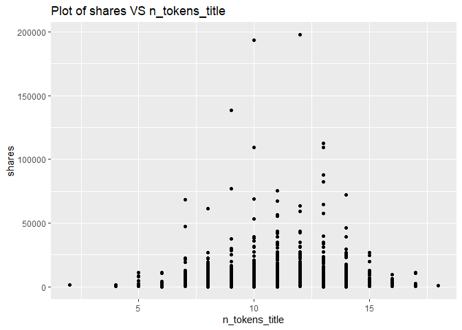
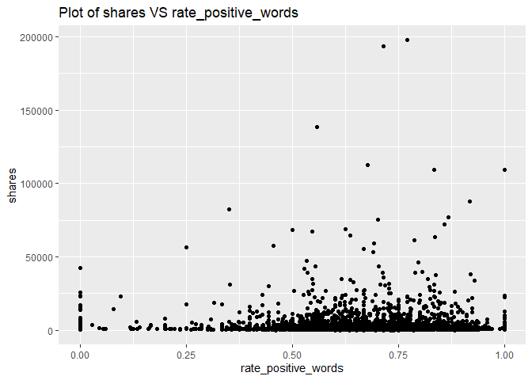
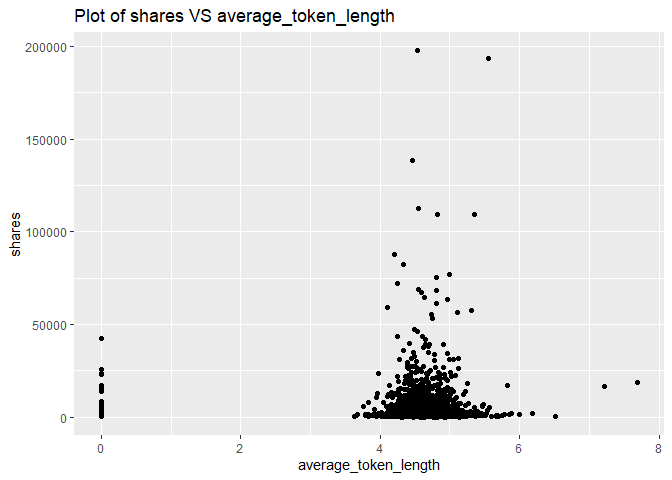

ST558 - Project 2
================
Li Wang & Bryan Bittner
2022-07-10

-   [Load Packages](#load-packages)
-   [Introduction](#introduction)
-   [Data](#data)
-   [Data Train/Test Split](#data-traintest-split)
-   [Summarizations](#summarizations)
    -   [Data structure and basic summary
        statistics](#data-structure-and-basic-summary-statistics)
    -   [Plots](#plots)
    -   [Feature selection](#feature-selection)
-   [Modeling](#modeling)
    -   [Linear Regression Model](#linear-regression-model)
    -   [Random Forest Model](#random-forest-model)
    -   [Boosted Tree Model](#boosted-tree-model)
-   [Comparison](#comparison)
-   [Automation](#automation)

``` r
rmarkdown::render("Project2.Rmd", 
                  output_format = "github_document",
                  output_file = "README.md",
                  output_options = list(html_preview= FALSE,toc=TRUE,toc_depth=2,toc_float=TRUE)
)
```

# Load Packages

We will use the following packages:

``` r
library(rmarkdown)
library(httr)
library(jsonlite)
library(readr)
library(tidyverse)
library(lubridate)
library(knitr)
library(caret)
library(randomForest)
library(corrplot)
library(gbm)
```

# Introduction

This [online News Popularity Data
Set](https://archive.ics.uci.edu/ml/datasets/Online+News+Popularity)
summarizes a heterogeneous set of features about articles published by
Mashable in a period of two years.

Our target variable is the shares variable(Number of shares ), and
predict variables are the following:

-   publishing_day: Day of the article published
-   n_tokens_title: Number of words in the title
-   n_tokens_content: Number of words in the content
-   num_self_hrefs: Number of links to other articles published by
    Mashable
-   num_imgs: Number of images
-   num_videos: Number of videos
-   average_token_length: Average length of the words in the content
-   num_keywords: Number of keywords in the metadata
-   kw_avg_min: Worst keyword (avg. shares)
-   kw_avg_avg: Avg. keyword (avg. shares)
-   self_reference_avg_shares: Avg. shares of referenced articles in
    Mashable
-   LDA_04: Closeness to LDA topic 4
-   global_subjectivity: ext subjectivity
-   global_rate_positive_words: Rate of positive words in the content
-   rate_positive_words: Rate of positive words among non-neutral tokens
-   avg_positive_polarity: Avg. polarity of positive words
-   min_positive_polarity: Min. polarity of positive words
-   avg_negative_polarity: Avg. polarity of negative words
-   max_negative_polarity: Max. polarity of negative words
-   title_subjectivity: Title subjectivity

The purpose of our analysis is to predict the number of shares in social
networks (popularity). In this project, we produce some basic summary
statistics and plots about the training data, and fit a linear
regression model and an ensemble tree-based model.

# Data

Use a relative path to import the data.

``` r
newsData<-read_csv(file="../Datasets/OnlineNewsPopularity.csv")
head(newsData)
```

    ## # A tibble: 6 × 61
    ##   url                timedelta n_tokens_title n_tokens_content n_unique_tokens n_non_stop_words n_non_stop_uniq… num_hrefs
    ##   <chr>                  <dbl>          <dbl>            <dbl>           <dbl>            <dbl>            <dbl>     <dbl>
    ## 1 http://mashable.c…       731             12              219           0.664             1.00            0.815         4
    ## 2 http://mashable.c…       731              9              255           0.605             1.00            0.792         3
    ## 3 http://mashable.c…       731              9              211           0.575             1.00            0.664         3
    ## 4 http://mashable.c…       731              9              531           0.504             1.00            0.666         9
    ## 5 http://mashable.c…       731             13             1072           0.416             1.00            0.541        19
    ## 6 http://mashable.c…       731             10              370           0.560             1.00            0.698         2
    ## # … with 53 more variables: num_self_hrefs <dbl>, num_imgs <dbl>, num_videos <dbl>, average_token_length <dbl>,
    ## #   num_keywords <dbl>, data_channel_is_lifestyle <dbl>, data_channel_is_entertainment <dbl>, data_channel_is_bus <dbl>,
    ## #   data_channel_is_socmed <dbl>, data_channel_is_tech <dbl>, data_channel_is_world <dbl>, kw_min_min <dbl>,
    ## #   kw_max_min <dbl>, kw_avg_min <dbl>, kw_min_max <dbl>, kw_max_max <dbl>, kw_avg_max <dbl>, kw_min_avg <dbl>,
    ## #   kw_max_avg <dbl>, kw_avg_avg <dbl>, self_reference_min_shares <dbl>, self_reference_max_shares <dbl>,
    ## #   self_reference_avg_sharess <dbl>, weekday_is_monday <dbl>, weekday_is_tuesday <dbl>, weekday_is_wednesday <dbl>,
    ## #   weekday_is_thursday <dbl>, weekday_is_friday <dbl>, weekday_is_saturday <dbl>, weekday_is_sunday <dbl>, …

Subset the data. If running the reports by an automated parameter driven
process, the report will automatically use the parameter passed into
this report. If running the report manually without a parameter, the
data will subset to the ‘lifestyle’ news channel.

``` r
#Read the parameter being passed in to the automated report
if (params$columnNames != "") {
  paramColumnNameType<-params$columnNames
}else{
  paramColumnNameType<-"lifestyle"
}

columnName<-paste("data_channel_is_",paramColumnNameType,sep="")

#According to dplyr help, to refer to column names stored as string, use the '.data' pronoun.
#https://dplyr.tidyverse.org/reference/filter.html
newsDataSubset <- filter(newsData,.data[[columnName]] == 1)
```

Merging the weekdays columns channels as one single column named
publishing_day.

``` r
# Merging the weekdays columns channels as one single column named publishing_day
newsDataSubset <- newsDataSubset %>%
  select(url, starts_with("weekday_is")) %>%
  pivot_longer(-url) %>%
  dplyr::filter(value > 0) %>%
  mutate(publishing_day = gsub("weekday_is_", "", name)) %>%
  left_join(newsDataSubset, by = "url") %>%
  select(-name, -starts_with("weekday_is_"))

# set the publishing_day as factor variable
newsDataSubset$publishing_day<- as.factor(newsDataSubset$publishing_day)
head(newsDataSubset)
```

    ## # A tibble: 6 × 56
    ##   url     value publishing_day timedelta n_tokens_title n_tokens_content n_unique_tokens n_non_stop_words n_non_stop_uniq…
    ##   <chr>   <dbl> <fct>              <dbl>          <dbl>            <dbl>           <dbl>            <dbl>            <dbl>
    ## 1 http:/…     1 monday               731             12              219           0.664             1.00            0.815
    ## 2 http:/…     1 monday               731              9              531           0.504             1.00            0.666
    ## 3 http:/…     1 monday               731             14              194           0.765             1.00            0.840
    ## 4 http:/…     1 monday               731             12              161           0.669             1.00            0.752
    ## 5 http:/…     1 monday               731             11              454           0.566             1.00            0.755
    ## 6 http:/…     1 monday               731             12              177           0.741             1.00            0.823
    ## # … with 47 more variables: num_hrefs <dbl>, num_self_hrefs <dbl>, num_imgs <dbl>, num_videos <dbl>,
    ## #   average_token_length <dbl>, num_keywords <dbl>, data_channel_is_lifestyle <dbl>, data_channel_is_entertainment <dbl>,
    ## #   data_channel_is_bus <dbl>, data_channel_is_socmed <dbl>, data_channel_is_tech <dbl>, data_channel_is_world <dbl>,
    ## #   kw_min_min <dbl>, kw_max_min <dbl>, kw_avg_min <dbl>, kw_min_max <dbl>, kw_max_max <dbl>, kw_avg_max <dbl>,
    ## #   kw_min_avg <dbl>, kw_max_avg <dbl>, kw_avg_avg <dbl>, self_reference_min_shares <dbl>,
    ## #   self_reference_max_shares <dbl>, self_reference_avg_sharess <dbl>, is_weekend <dbl>, LDA_00 <dbl>, LDA_01 <dbl>,
    ## #   LDA_02 <dbl>, LDA_03 <dbl>, LDA_04 <dbl>, global_subjectivity <dbl>, global_sentiment_polarity <dbl>, …

Here we drop some non-preditive variables:
url,value,timedelta,data_channel_is_lifestyle,
data_channel_is_entertainment,data_channel_is_bus,
data_channel_is_socmed ,data_channel_is_tech,data_channel_is_world
columns,is_weekend. They won’t contribute anything.

``` r
newsDataSubset<-newsDataSubset%>%select(-c(1,2,4,16:21,34))
newsDataSubset
```

    ## # A tibble: 7,057 × 46
    ##    publishing_day n_tokens_title n_tokens_content n_unique_tokens n_non_stop_words n_non_stop_unique_tokens num_hrefs
    ##    <fct>                   <dbl>            <dbl>           <dbl>            <dbl>                    <dbl>     <dbl>
    ##  1 monday                     12              219           0.664             1.00                    0.815         4
    ##  2 monday                      9              531           0.504             1.00                    0.666         9
    ##  3 monday                     14              194           0.765             1.00                    0.840         4
    ##  4 monday                     12              161           0.669             1.00                    0.752         5
    ##  5 monday                     11              454           0.566             1.00                    0.755         5
    ##  6 monday                     12              177           0.741             1.00                    0.823         4
    ##  7 monday                      5              356           0.618             1.00                    0.766         3
    ##  8 tuesday                    11              281           0.611             1.00                    0.766         5
    ##  9 tuesday                    10              909           0.450             1.00                    0.670         3
    ## 10 wednesday                  10              413           0.606             1.00                    0.729         6
    ## # … with 7,047 more rows, and 39 more variables: num_self_hrefs <dbl>, num_imgs <dbl>, num_videos <dbl>,
    ## #   average_token_length <dbl>, num_keywords <dbl>, kw_min_min <dbl>, kw_max_min <dbl>, kw_avg_min <dbl>,
    ## #   kw_min_max <dbl>, kw_max_max <dbl>, kw_avg_max <dbl>, kw_min_avg <dbl>, kw_max_avg <dbl>, kw_avg_avg <dbl>,
    ## #   self_reference_min_shares <dbl>, self_reference_max_shares <dbl>, self_reference_avg_sharess <dbl>, LDA_00 <dbl>,
    ## #   LDA_01 <dbl>, LDA_02 <dbl>, LDA_03 <dbl>, LDA_04 <dbl>, global_subjectivity <dbl>, global_sentiment_polarity <dbl>,
    ## #   global_rate_positive_words <dbl>, global_rate_negative_words <dbl>, rate_positive_words <dbl>,
    ## #   rate_negative_words <dbl>, avg_positive_polarity <dbl>, min_positive_polarity <dbl>, max_positive_polarity <dbl>, …

# Data Train/Test Split

Lets set up our Train/Test split. This will allow us to determine the
model fit using a subset of data called Training, while saving the
remainder of the data called Test to test our model predictions with.

``` r
set.seed(111)
train <- sample(1:nrow(newsDataSubset),size=nrow(newsDataSubset)*0.7)
test <- dplyr::setdiff(1:nrow(newsDataSubset),train)

newsDataSubsetTrain <- newsDataSubset[train,]
newsDataSubsetTest <- newsDataSubset[test,]
```

# Summarizations

## Data structure and basic summary statistics

Start with the data structure and basic summary statistics for the
‘shares’ field.

``` r
# data structure
str(newsDataSubsetTrain)
```

    ## tibble [4,939 × 46] (S3: tbl_df/tbl/data.frame)
    ##  $ publishing_day              : Factor w/ 7 levels "friday","monday",..: 1 5 6 2 5 5 4 2 6 2 ...
    ##  $ n_tokens_title              : num [1:4939] 10 14 9 14 11 9 15 11 10 11 ...
    ##  $ n_tokens_content            : num [1:4939] 624 643 592 115 758 197 188 615 0 874 ...
    ##  $ n_unique_tokens             : num [1:4939] 0.522 0.484 0.546 0.759 0.516 ...
    ##  $ n_non_stop_words            : num [1:4939] 1 1 1 1 1 ...
    ##  $ n_non_stop_unique_tokens    : num [1:4939] 0.619 0.635 0.664 0.889 0.681 ...
    ##  $ num_hrefs                   : num [1:4939] 37 14 15 6 27 5 2 6 0 11 ...
    ##  $ num_self_hrefs              : num [1:4939] 1 2 2 3 7 4 1 5 0 4 ...
    ##  $ num_imgs                    : num [1:4939] 1 1 1 0 16 1 0 30 0 13 ...
    ##  $ num_videos                  : num [1:4939] 0 0 0 0 1 0 0 0 1 0 ...
    ##  $ average_token_length        : num [1:4939] 4.65 4.65 4.71 4.4 4.62 ...
    ##  $ num_keywords                : num [1:4939] 7 6 8 7 10 5 5 7 7 7 ...
    ##  $ kw_min_min                  : num [1:4939] -1 -1 4 217 -1 4 4 -1 -1 -1 ...
    ##  $ kw_max_min                  : num [1:4939] 8100 585 1400 614 905 867 573 770 721 1800 ...
    ##  $ kw_avg_min                  : num [1:4939] 1460 241 497 423 340 ...
    ##  $ kw_min_max                  : num [1:4939] 0 1500 2200 1900 4700 3800 2200 6200 2700 6400 ...
    ##  $ kw_max_max                  : num [1:4939] 843300 843300 690400 51900 843300 ...
    ##  $ kw_avg_max                  : num [1:4939] 216743 226250 215900 25443 156840 ...
    ##  $ kw_min_avg                  : num [1:4939] 0 900 1800 942 1325 ...
    ##  $ kw_max_avg                  : num [1:4939] 17150 7453 15050 3077 8926 ...
    ##  $ kw_avg_avg                  : num [1:4939] 4828 3918 5921 2400 4289 ...
    ##  $ self_reference_min_shares   : num [1:4939] 818 1200 0 1400 4100 1300 573 1100 0 6400 ...
    ##  $ self_reference_max_shares   : num [1:4939] 818 3100 0 4300 11600 1300 573 1700 0 22300 ...
    ##  $ self_reference_avg_sharess  : num [1:4939] 818 2150 0 2833 8075 ...
    ##  $ LDA_00                      : num [1:4939] 0.0286 0.0333 0.025 0.6825 0.1293 ...
    ##  $ LDA_01                      : num [1:4939] 0.0297 0.8665 0.65 0.2302 0.2881 ...
    ##  $ LDA_02                      : num [1:4939] 0.0286 0.0333 0.025 0.0287 0.02 ...
    ##  $ LDA_03                      : num [1:4939] 0.8845 0.0335 0.275 0.0291 0.5425 ...
    ##  $ LDA_04                      : num [1:4939] 0.0286 0.0333 0.025 0.0295 0.0201 ...
    ##  $ global_subjectivity         : num [1:4939] 0.646 0.455 0.57 0.398 0.51 ...
    ##  $ global_sentiment_polarity   : num [1:4939] 0.14776 0.00804 0.32988 0.31234 0.13363 ...
    ##  $ global_rate_positive_words  : num [1:4939] 0.0481 0.0358 0.0541 0.0609 0.0383 ...
    ##  $ global_rate_negative_words  : num [1:4939] 0.01763 0.0311 0.00845 0 0.01055 ...
    ##  $ rate_positive_words         : num [1:4939] 0.732 0.535 0.865 1 0.784 ...
    ##  $ rate_negative_words         : num [1:4939] 0.268 0.465 0.135 0 0.216 ...
    ##  $ avg_positive_polarity       : num [1:4939] 0.453 0.338 0.406 0.408 0.318 ...
    ##  $ min_positive_polarity       : num [1:4939] 0.1364 0.1 0.1 0.1364 0.0333 ...
    ##  $ max_positive_polarity       : num [1:4939] 1 1 1 0.8 1 0.6 0.7 0.8 0 1 ...
    ##  $ avg_negative_polarity       : num [1:4939] -0.439 -0.364 -0.28 0 -0.433 ...
    ##  $ min_negative_polarity       : num [1:4939] -0.6 -0.7 -0.5 0 -1 ...
    ##  $ max_negative_polarity       : num [1:4939] -0.2 -0.05 -0.05 0 -0.05 -1 -0.3 -0.1 0 -0.05 ...
    ##  $ title_subjectivity          : num [1:4939] 0.95 0.4 0.571 0.375 0 ...
    ##  $ title_sentiment_polarity    : num [1:4939] -0.175 -0.4 0.357 -0.125 0 ...
    ##  $ abs_title_subjectivity      : num [1:4939] 0.45 0.1 0.0714 0.125 0.5 ...
    ##  $ abs_title_sentiment_polarity: num [1:4939] 0.175 0.4 0.357 0.125 0 ...
    ##  $ shares                      : num [1:4939] 716 1200 977 349 4400 903 1400 1800 6400 75600 ...

``` r
# data summary
summary(newsDataSubsetTrain$shares)
```

    ##    Min. 1st Qu.  Median    Mean 3rd Qu.    Max. 
    ##      47     827    1100    2874    2000  197600

Now lets show the Mean, Median, Variance, and Standard Deviation. Notice
the Variance and Standard Deviation are both extremely high. This might
be something we will have to investigate further.

``` r
newsDataSubsetTrain %>% summarise(avg = mean(shares), med = median(shares), var = var(shares), sd = sd(shares))
```

    ## # A tibble: 1 × 4
    ##     avg   med       var    sd
    ##   <dbl> <dbl>     <dbl> <dbl>
    ## 1 2874.  1100 58100158. 7622.

Looking at the different columns in the dataset, there are two that
stand out. Generally speaking, people probably aren’t going to look at
articles that don’t have images or videos. Here are the summary stats
for the articles grouped on the number of images in the article.

``` r
newsDataSubsetTrain %>% group_by(num_imgs) %>%
summarise(avg = mean(shares), med = median(shares), var = var(shares), sd = sd(shares))
```

    ## # A tibble: 72 × 5
    ##    num_imgs   avg   med       var    sd
    ##       <dbl> <dbl> <dbl>     <dbl> <dbl>
    ##  1        0 3307.  1100 49011947. 7001.
    ##  2        1 2152.  1100 19125947. 4373.
    ##  3        2 2455.  1100 51760621. 7194.
    ##  4        3 1987.  1100  9286475. 3047.
    ##  5        4 3059.  1200 20089106. 4482.
    ##  6        5 2853.  1200 31683649. 5629.
    ##  7        6 2764.  1300 17897436. 4231.
    ##  8        7 2200.  1200  6456030. 2541.
    ##  9        8 4455.  1250 74937052. 8657.
    ## 10        9 3628.  1400 57435133. 7579.
    ## # … with 62 more rows

As we can see from the above table, the largest avg of shares is with 28
images, and the least avg of shares is with 23 images. Therefore, the
number of images variable affects shares, and we will keep this
variable.

Here are the summary stats for articles with videos.

``` r
newsDataSubsetTrain %>% group_by(num_videos) %>%
summarise(avg = mean(shares), med = median(shares), var = var(shares), sd = sd(shares))
```

    ## # A tibble: 47 × 5
    ##    num_videos   avg   med        var     sd
    ##         <dbl> <dbl> <dbl>      <dbl>  <dbl>
    ##  1          0 2371.  1100  26541093.  5152.
    ##  2          1 3516.  1200 109999893. 10488.
    ##  3          2 3033.  1200  58174563.  7627.
    ##  4          3 2700.  1150  26747565.  5172.
    ##  5          4 3312.  1300  66915351.  8180.
    ##  6          5 2971.  1150  36636753.  6053.
    ##  7          6 5857.  1300 440973862. 20999.
    ##  8          7 2986.  1100  20691567.  4549.
    ##  9          8 3558.  1550  14037050.  3747.
    ## 10          9 1669.  1200   2794495.  1672.
    ## # … with 37 more rows

As we can see from the above table, the largest avg of shares is with 15
videos, and the least avg of shares is with 28 videos Therefore, the
number of videos variable affects shares, and we will keep this
variable.

## Plots

A plot with the number of shares on the y-axis and n_tokens_title on the
x-axis is created:

``` r
g <- ggplot(newsDataSubsetTrain, aes(x = n_tokens_title, y = shares))
g + geom_point()+labs(title = "Plot of shares VS n_tokens_title")
```

<!-- -->

From the above plot, we can see that the most shares is with 6-15 words
in the title. Therefore, the number of words in the title affects
shares, and we will keep n_tokens_title variable.

A plot with the number of shares on the y-axis and publishing_day on the
x-axis is created:

``` r
g <- ggplot(newsDataSubsetTrain, aes(x = publishing_day, y = shares))
g + geom_point()+labs(title = "Plot of shares VS publishing_day")
```

<!-- -->

From the above plot, we can see that the best popular articles are
usually posted on Monday, Tuesday, and Wednesday. Articles is less
popularity which are published on Sunday and Saturday. Therefore, the
publishing_day affects shares, and we will keep publishing_day.

A plot with the number of shares on the y-axis and rate_positive_words
on the x-axis is created:

``` r
g <- ggplot(newsDataSubsetTrain, aes(x = rate_positive_words, y = shares))
g + geom_point()+labs(title = "Plot of shares VS rate_positive_words")
```

<!-- -->

From the above plot, we can see that the best popular articles are with
0.5-0.9 rate_positive_words. Therefore, the variable rate_positive_words
effects shares, and we will keep this variable.

A plot with the number of shares on the y-axis and n_tokens_content on
the x-axis is created:

``` r
g <- ggplot(newsDataSubsetTrain, aes(x = n_tokens_content, y = shares))
g + geom_point()+labs(title = "Plot of shares VS n_tokens_content")
```

<!-- -->

From the above plot, we can see that the number of words in the article
less than 2000 words are with good shares. The less the better.
Therefore, the variable n_tokens_content effects shares, and we will
keep this variable.

A plot with the number of shares on the y-axis and average_token_length
on the x-axis is created:

``` r
g <- ggplot(newsDataSubsetTrain, aes(x = average_token_length, y = shares))
g + geom_point()+labs(title = "Plot of shares VS average_token_length")
```

<!-- -->

From the above plot, we can see that the almost shares are with 4-6
length word. Therefore, the variable average_token_length effects
shares, and we will keep this variable.

Correlation matrix plot is generated:

``` r
newsDataSubsetTrain1<-select(newsDataSubsetTrain,-publishing_day)
corr=cor(newsDataSubsetTrain1, method = c("spearman"))
corrplot(corr,tl.cex=0.5)
```

<!-- -->

By the above correlation matrix plot, we can see these variables are
strongly correlated:

-   title_subjectivity, abs_title_sentiment_polarity,
    abs_title_subjectivity, title_sentiment_polarity
-   avg_negative_polarity, min_negative_polarity
-   max_positive_polarity, avg_positive_polarity
-   global_rate_negative_words, rate_negative_words,rate_positive_words
-   global_sentiment_polarity, rate_negative_words, rate_positive_words
-   LDA_03,LDA_04
-   LDA_00,LDA_04
-   self_reference_max_shares, self_reference_avg_shares,
    self_reference_min_shares
-   kw_max_avg, kw_avg_avg
-   kw_min_avg,kw_avg_avg,kw_min_max
-   kw_avg_max,kw_avg_avg,kw_max_max
-   kw_avg_min,kw_avg_max
-   kw_max_min,kw_avg_min,kw_min_min
-   kw_min_min,kw_avg_max
-   num_keywords,LDA_01
-   num_keywords,LDA_02
-   num_hrefs, num_imgs
-   n_non_stop_unique_tokens, num_imgs
-   n_non_stop_words, n_non_stop_unique_tokens
-   n_unique_tokens,n_non_stop_unique_tokens
-   n_unique_tokens, n_non_stop_words, n_tokens_content
-   n_tokens_content, n_non_stop_unique_tokens
-   n_tokens_content, num_hrefs

These are strongly correlated which makes us to assume that these
features are so linearly dependent that any one of the strong correlated
feature can be used and excluding the other features with high
correlation.

## Feature selection

Let’s do feature selection:

``` r
newsDataSubsetTrain2<-select(newsDataSubsetTrain,-abs_title_sentiment_polarity, -abs_title_subjectivity, -title_sentiment_polarity,-min_negative_polarity,-max_positive_polarity,-rate_negative_words,-global_rate_negative_words,-global_sentiment_polarity,-LDA_03,-LDA_00,-self_reference_max_shares,-self_reference_min_shares,-kw_max_avg,-kw_min_avg,-kw_min_max,-kw_avg_max,-kw_max_max,-kw_max_min,-kw_min_min,-LDA_01,-LDA_02,-num_hrefs,-n_non_stop_unique_tokens,-n_unique_tokens,-n_non_stop_words)

newsDataSubsetTest2<-select(newsDataSubsetTrain,-abs_title_sentiment_polarity, -abs_title_subjectivity, -title_sentiment_polarity,-min_negative_polarity,-max_positive_polarity,-rate_negative_words,-global_rate_negative_words,-global_sentiment_polarity,-LDA_03,-LDA_00,-self_reference_max_shares,-self_reference_min_shares,-kw_max_avg,-kw_min_avg,-kw_min_max,-kw_avg_max,-kw_max_max,-kw_max_min,-kw_min_min,-LDA_01,-LDA_02,-num_hrefs,-n_non_stop_unique_tokens,-n_unique_tokens,-n_non_stop_words)
```

# Modeling

## Linear Regression Model

A Linear Regression Model is the first model type we will look at. These
models are an intuitive way to investigate the linear relation between
multiple variables. These models make the estimation procedure simple
and easy to understand. Linear Regression models can come in all
different shapes and sizes and can be used to model more than just a
straight linear relationship. Regression models can be modified with
interactive and or higher order terms that will conform to a more
complex relationship.

For the first linear model example, we can try a model using just the
“num_imgs” and “num_videos” as our predictors.

``` r
set.seed(111)
#Fit a  multiple linear regression model using just the "num_imgs" and "num_videos" as our predictors. 
mlrFit <- train(shares ~ num_imgs + num_videos, 
                data = newsDataSubsetTrain2, 
                method="lm",
                trControl=trainControl(method="cv",number=5))
mlrFit
```

    ## Linear Regression 
    ## 
    ## 4939 samples
    ##    2 predictor
    ## 
    ## No pre-processing
    ## Resampling: Cross-Validated (5 fold) 
    ## Summary of sample sizes: 3950, 3952, 3951, 3952, 3951 
    ## Resampling results:
    ## 
    ##   RMSE      Rsquared     MAE     
    ##   7523.604  0.002479554  2827.279
    ## 
    ## Tuning parameter 'intercept' was held constant at a value of TRUE

Next we can try a linear model using all of the fields as a predictor
variables.

``` r
#Fit a  multiple linear regression model using all of the fields as a predictor variables.
set.seed(111)
mlrAllFit <- train(shares ~ ., 
                data = newsDataSubsetTrain2, 
                method="lm",
                trControl=trainControl(method="cv",number=5))
mlrAllFit
```

    ## Linear Regression 
    ## 
    ## 4939 samples
    ##   20 predictor
    ## 
    ## No pre-processing
    ## Resampling: Cross-Validated (5 fold) 
    ## Summary of sample sizes: 3950, 3952, 3951, 3952, 3951 
    ## Resampling results:
    ## 
    ##   RMSE      Rsquared    MAE     
    ##   7685.046  0.01254769  2800.747
    ## 
    ## Tuning parameter 'intercept' was held constant at a value of TRUE

Try a model using just the num_imgs + num_videos + kw_avg_avg +
num_imgs\*kw_avg_avg as our predictors.

``` r
set.seed(111)
#Fit a  multiple linear regression model with num_imgs + num_videos + kw_avg_avg + num_imgs*kw_avg_avg. 
mlrInteractionFit <- train(shares ~ num_imgs + num_videos + kw_avg_avg + num_imgs*kw_avg_avg, 
                data = newsDataSubsetTrain2, 
                method="lm",
                trControl=trainControl(method="cv",number=5))
mlrInteractionFit
```

    ## Linear Regression 
    ## 
    ## 4939 samples
    ##    3 predictor
    ## 
    ## No pre-processing
    ## Resampling: Cross-Validated (5 fold) 
    ## Summary of sample sizes: 3950, 3952, 3951, 3952, 3951 
    ## Resampling results:
    ## 
    ##   RMSE      Rsquared    MAE     
    ##   7449.128  0.07254646  2839.191
    ## 
    ## Tuning parameter 'intercept' was held constant at a value of TRUE

## Random Forest Model

The Random Forest Model is an example of an ensemble based model.
Instead of traditional decision trees, ensemble methods average across
the tree. This will greatly increase our prediction power, but it will
come at the expense of the easy interpretation from traditional decision
trees. The Random Forest based model will not use all available
predictors. Instead it will take a random subset of the predictors for
each tree fit and calculate the model fit for that subset. It will
repeat the process a pre-determined number of times and automatically
pick the best predictors for the model. This will end up creating a
reduction in the overall model variance.

``` r
set.seed(111)
randomForestFit <- train(shares ~ ., 
                         data = newsDataSubsetTrain2, 
                         method="rf",
                         preProcess=c("center","scale"),
                         trControl=trainControl(method="cv",number=5),
                         tuneGrid=data.frame(mtry=ncol(newsDataSubsetTrain)/3))
randomForestFit
```

    ## Random Forest 
    ## 
    ## 4939 samples
    ##   20 predictor
    ## 
    ## Pre-processing: centered (25), scaled (25) 
    ## Resampling: Cross-Validated (5 fold) 
    ## Summary of sample sizes: 3950, 3952, 3951, 3952, 3951 
    ## Resampling results:
    ## 
    ##   RMSE      Rsquared    MAE     
    ##   7792.154  0.01881926  3011.995
    ## 
    ## Tuning parameter 'mtry' was held constant at a value of 15.33333

## Boosted Tree Model

Boosted Regression Tree (BRT) models are a combination of two
techniques: decision tree algorithms and boosting methods. It repeatedly
fits many decision trees to improve the accuracy of the model.

Boosted Regression Tree uses the boosting method in which the input data
are weighted in subsequent trees. The weights are applied in such a way
that data that was poorly modelled by previous trees has a higher
probability of being selected in the new tree. This means that after the
first tree is fitted the model will take into account the error in the
prediction of that tree to fit the next tree, and so on. By taking into
account the fit of previous trees that are built, the model continuously
tries to improve its accuracy. This sequential approach is unique to
boosting.

``` r
set.seed(111)
BoostedTreeFit <- train(shares ~ ., 
                         data = newsDataSubsetTrain2,
                         distribution = "gaussian",
                         method="gbm",
                         trControl=trainControl(method="cv",number=5),
                         verbose = FALSE)
BoostedTreeFit
```

    ## Stochastic Gradient Boosting 
    ## 
    ## 4939 samples
    ##   20 predictor
    ## 
    ## No pre-processing
    ## Resampling: Cross-Validated (5 fold) 
    ## Summary of sample sizes: 3950, 3952, 3951, 3952, 3951 
    ## Resampling results across tuning parameters:
    ## 
    ##   interaction.depth  n.trees  RMSE      Rsquared    MAE     
    ##   1                   50      7536.192  0.02095129  2794.361
    ##   1                  100      7485.272  0.02316693  2768.809
    ##   1                  150      7522.601  0.02173638  2768.037
    ##   2                   50      7425.677  0.03712411  2761.437
    ##   2                  100      7449.526  0.03675335  2776.668
    ##   2                  150      7521.257  0.03247155  2792.890
    ##   3                   50      7501.474  0.02857567  2794.342
    ##   3                  100      7572.383  0.02705559  2830.249
    ##   3                  150      7655.950  0.03040151  2854.005
    ## 
    ## Tuning parameter 'shrinkage' was held constant at a value of 0.1
    ## Tuning parameter 'n.minobsinnode' was held constant at
    ##  a value of 10
    ## RMSE was used to select the optimal model using the smallest value.
    ## The final values used for the model were n.trees = 50, interaction.depth = 2, shrinkage = 0.1 and n.minobsinnode = 10.

# Comparison

All the models are compared by RMSE on the test set

``` r
set.seed(111)
#compute RMSE of MlrFit
mlrFitPred <- predict(mlrFit, newdata = newsDataSubsetTest2)
MlrFit<-postResample(mlrFitPred, newsDataSubsetTest2$shares)
MlrFit.RMSE<-MlrFit[1]

#compute RMSE of MlrAllFit
MlrAllFitPred <- predict(mlrAllFit, newdata = newsDataSubsetTest2)
MlrAllFit<-postResample(MlrAllFitPred, newsDataSubsetTest2$shares)
MlrAllFit.RMSE<-MlrAllFit[1]

#compute RMSE of MlrInterFit
mlrInteractionFitPred <- predict(mlrInteractionFit, newdata = newsDataSubsetTest2)
MlrInterFit<-postResample(mlrInteractionFitPred, newsDataSubsetTest2$shares)
MlrInterFit.RMSE<-MlrInterFit[1]

#compute RMSE of RandomForest
ForestPred <- predict(randomForestFit, newdata = newsDataSubsetTest2)
RandomForest<-postResample(ForestPred, newsDataSubsetTest2$shares)
RandomForest.RMSE<-RandomForest[1]

#compute RMSE of BoostedTree
BoostPred <- predict(BoostedTreeFit, newdata = newsDataSubsetTest2)
BoostedTree<-postResample(BoostPred, newsDataSubsetTest2$shares)
BoostedTree.RMSE<-BoostedTree[1]

#Compare Root MSE values
c(MlrFit=MlrFit.RMSE,MlrAllFit=MlrAllFit.RMSE,MlrInterFit=MlrInterFit.RMSE,RandomForest=RandomForest.RMSE,BoostedTree=BoostedTree.RMSE)
```

    ##       MlrFit.RMSE    MlrAllFit.RMSE  MlrInterFit.RMSE RandomForest.RMSE  BoostedTree.RMSE 
    ##          7613.670          7402.349          7372.849          3865.106          7117.314

From the above compare, we can see the smallest RMSE is 5403.120 which
belong to RandomForest. Therefore, we will choose the Random Forest
Model.

# Automation

Below is a chuck of code that can be used to automate the reports. In
order to automate this project, the first thing we do is build a set of
parameters. These parameters match up with the column names from the
full news dataset. The program with read the parameter and subset the
data down to only values with the specified news channel name that is in
the parameter.

To automate the project for all of the different news channels, simply
execute the code chunk below directly to the console. Separate .md files
will then be created for each news channel type.

``` automate
#Add column names
columnNames <- data.frame("lifestyle","entertainment","bus","socmed","tech","world")

#Create filenames
output_file<-paste0(columnNames,".md")

#create a list for each column name
params = lapply(columnNames, FUN = function(x){list(columnNames = x)})

#put into a data frame
reports<-tibble(output_file,params)

#Render Code
apply(reports, MARGIN=1,FUN=function(x)
  {
    rmarkdown::render(input="Project2.Rmd",
    output_format="github_document",
    output_file=x[[1]],
    params=x[[2]],
    output_options = list(html_preview= FALSE,toc=TRUE,toc_depth=2,toc_float=TRUE)
    )
  }
)
```
