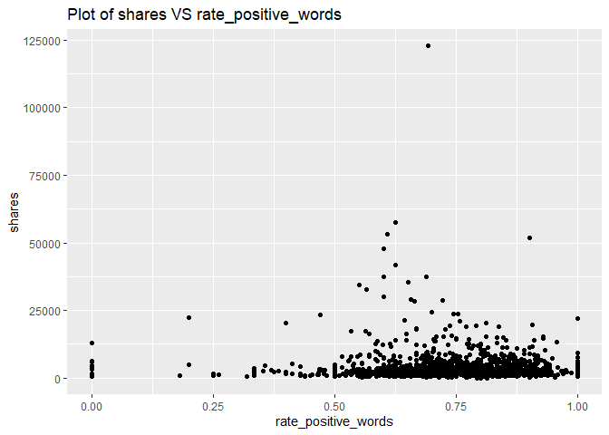
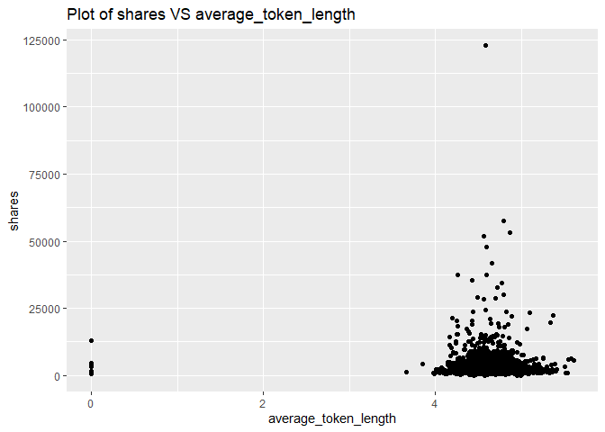

ST558 - Project 2
================
Li Wang & Bryan Bittner
2022-07-07

``` r
rmarkdown::render("Project2.Rmd", 
                  output_format = "github_document",
                  output_file = "README.md",
                  output_options = list(html_preview= FALSE,toc=TRUE,toc_depth=2,toc_float=TRUE)
)
```

# Load Packages

We will use the following packages:

``` r
library(rmarkdown)
library(httr)
library(jsonlite)
library(readr)
library(tidyverse)
library(lubridate)
library(knitr)
library(caret)
library(randomForest)
library(corrplot)
library(gbm)
```

# Introduction

This data set summarizes a heterogeneous set of features about articles
published by Mashable in a period of two years.

Our target variable is the shares variable, and predict variables are
the following:

publishing_day: Day of the article published n_tokens_title: Number of
words in the title n_tokens_content: Number of words in the content
num_self_hrefs: Number of links to other articles published by Mashable
num_imgs: Number of images num_videos: Number of videos
average_token_length: Average length of the words in the content
num_keywords: Number of keywords in the metadata kw_avg_min: Worst
keyword (avg. shares) kw_avg_avg: Avg. keyword (avg. shares)
self_reference_avg_shares: Avg. shares of referenced articles in
Mashable LDA_04: Closeness to LDA topic 4 global_subjectivity: ext
subjectivity global_rate_positive_words: Rate of positive words in the
content rate_positive_words: Rate of positive words among non-neutral
tokens avg_positive_polarity: Avg. polarity of positive words
min_positive_polarity: Min. polarity of positive words
avg_negative_polarity: Avg. polarity of negative words
max_negative_polarity: Max. polarity of negative words
title_subjectivity: Title subjectivity

The purpose of our analysis is to predict the number of shares in social
networks (popularity). In this project, we produce some basic (but
meaningful) summary statistics and plots about the training data, and
fit a linear regression model and an ensemble tree-based model for
predicting the number of shares.

# Data

Use a relative path to import the data.

``` r
newsData<-read_csv(file="../Datasets/OnlineNewsPopularity.csv")
head(newsData)
```

    ## # A tibble: 6 × 61
    ##   url                timedelta n_tokens_title n_tokens_content n_unique_tokens n_non_stop_words n_non_stop_uniq… num_hrefs
    ##   <chr>                  <dbl>          <dbl>            <dbl>           <dbl>            <dbl>            <dbl>     <dbl>
    ## 1 http://mashable.c…       731             12              219           0.664             1.00            0.815         4
    ## 2 http://mashable.c…       731              9              255           0.605             1.00            0.792         3
    ## 3 http://mashable.c…       731              9              211           0.575             1.00            0.664         3
    ## 4 http://mashable.c…       731              9              531           0.504             1.00            0.666         9
    ## 5 http://mashable.c…       731             13             1072           0.416             1.00            0.541        19
    ## 6 http://mashable.c…       731             10              370           0.560             1.00            0.698         2
    ## # … with 53 more variables: num_self_hrefs <dbl>, num_imgs <dbl>, num_videos <dbl>, average_token_length <dbl>,
    ## #   num_keywords <dbl>, data_channel_is_lifestyle <dbl>, data_channel_is_entertainment <dbl>, data_channel_is_bus <dbl>,
    ## #   data_channel_is_socmed <dbl>, data_channel_is_tech <dbl>, data_channel_is_world <dbl>, kw_min_min <dbl>,
    ## #   kw_max_min <dbl>, kw_avg_min <dbl>, kw_min_max <dbl>, kw_max_max <dbl>, kw_avg_max <dbl>, kw_min_avg <dbl>,
    ## #   kw_max_avg <dbl>, kw_avg_avg <dbl>, self_reference_min_shares <dbl>, self_reference_max_shares <dbl>,
    ## #   self_reference_avg_sharess <dbl>, weekday_is_monday <dbl>, weekday_is_tuesday <dbl>, weekday_is_wednesday <dbl>,
    ## #   weekday_is_thursday <dbl>, weekday_is_friday <dbl>, weekday_is_saturday <dbl>, weekday_is_sunday <dbl>, …

Subset the data to work on the data channel of lifestyle

``` r
#Once we parameterize this file, part of the column name will be passed in as a parameter by the render code. I'm creating a separate field to handle this portion of the column name now and eventually we can just set the parameter to this field and the rest should work.

#Parameter Name will eventually go here instead of "lifestyle"
paramColumnNameType<-params$columnNames
columnName<-paste("data_channel_is_",paramColumnNameType,sep="")

#According to dplyr help, to refer to column names stored as string, use the '.data' pronoun.
#https://dplyr.tidyverse.org/reference/filter.html
newsDataSubset <- filter(newsData,.data[[columnName]] == 1)
```

Merging the weekdays columns channels as one single column named
publishing_day

``` r
# Merging the weekdays columns channels as one single column named publishing_day
newsDataSubset <- newsDataSubset %>%
  select(url, starts_with("weekday_is")) %>%
  pivot_longer(-url) %>%
  dplyr::filter(value > 0) %>%
  mutate(publishing_day = gsub("weekday_is_", "", name)) %>%
  left_join(newsDataSubset, by = "url") %>%
  select(-name, -starts_with("weekday_is_"))

# set the publishing_day as factor variable
newsDataSubset$publishing_day<- as.factor(newsDataSubset$publishing_day)
head(newsDataSubset)
```

    ## # A tibble: 6 × 56
    ##   url     value publishing_day timedelta n_tokens_title n_tokens_content n_unique_tokens n_non_stop_words n_non_stop_uniq…
    ##   <chr>   <dbl> <fct>              <dbl>          <dbl>            <dbl>           <dbl>            <dbl>            <dbl>
    ## 1 http:/…     1 monday               731              8              257           0.568             1.00            0.671
    ## 2 http:/…     1 monday               731              8              218           0.663             1.00            0.688
    ## 3 http:/…     1 monday               731              9             1226           0.410             1.00            0.617
    ## 4 http:/…     1 monday               731             10             1121           0.451             1.00            0.629
    ## 5 http:/…     1 wednesday            729              9              168           0.778             1.00            0.865
    ## 6 http:/…     1 wednesday            729              9              100           0.760             1.00            0.803
    ## # … with 47 more variables: num_hrefs <dbl>, num_self_hrefs <dbl>, num_imgs <dbl>, num_videos <dbl>,
    ## #   average_token_length <dbl>, num_keywords <dbl>, data_channel_is_lifestyle <dbl>, data_channel_is_entertainment <dbl>,
    ## #   data_channel_is_bus <dbl>, data_channel_is_socmed <dbl>, data_channel_is_tech <dbl>, data_channel_is_world <dbl>,
    ## #   kw_min_min <dbl>, kw_max_min <dbl>, kw_avg_min <dbl>, kw_min_max <dbl>, kw_max_max <dbl>, kw_avg_max <dbl>,
    ## #   kw_min_avg <dbl>, kw_max_avg <dbl>, kw_avg_avg <dbl>, self_reference_min_shares <dbl>,
    ## #   self_reference_max_shares <dbl>, self_reference_avg_sharess <dbl>, is_weekend <dbl>, LDA_00 <dbl>, LDA_01 <dbl>,
    ## #   LDA_02 <dbl>, LDA_03 <dbl>, LDA_04 <dbl>, global_subjectivity <dbl>, global_sentiment_polarity <dbl>, …

Here we drop some non-preditive variables:
url,value,timedelta,data_channel_is_lifestyle,
data_channel_is_entertainment,data_channel_is_bus,
data_channel_is_socmed ,data_channel_is_tech,data_channel_is_world
columns,is_weekend. They won’t contribute anything.

``` r
newsDataSubset<-newsDataSubset%>%select(-c(1,2,4,16:21,34))
```

## Summarizations

Start with the data structure and basic summary statistics for the
‘shares’ field.

``` r
# data structure
str(newsDataSubset)
```

    ## tibble [2,323 × 46] (S3: tbl_df/tbl/data.frame)
    ##  $ publishing_day              : Factor w/ 7 levels "friday","monday",..: 2 2 2 2 7 7 7 5 1 1 ...
    ##  $ n_tokens_title              : num [1:2323] 8 8 9 10 9 9 10 7 8 6 ...
    ##  $ n_tokens_content            : num [1:2323] 257 218 1226 1121 168 ...
    ##  $ n_unique_tokens             : num [1:2323] 0.568 0.663 0.41 0.451 0.778 ...
    ##  $ n_non_stop_words            : num [1:2323] 1 1 1 1 1 ...
    ##  $ n_non_stop_unique_tokens    : num [1:2323] 0.671 0.688 0.617 0.629 0.865 ...
    ##  $ num_hrefs                   : num [1:2323] 9 14 10 15 6 3 19 11 4 24 ...
    ##  $ num_self_hrefs              : num [1:2323] 7 3 10 11 4 2 10 1 4 6 ...
    ##  $ num_imgs                    : num [1:2323] 0 11 1 1 11 1 8 1 1 1 ...
    ##  $ num_videos                  : num [1:2323] 1 0 1 0 0 0 0 0 0 0 ...
    ##  $ average_token_length        : num [1:2323] 4.64 4.44 4.39 4.79 4.68 ...
    ##  $ num_keywords                : num [1:2323] 9 10 7 6 9 6 6 7 4 8 ...
    ##  $ kw_min_min                  : num [1:2323] 0 0 0 0 217 217 217 217 217 217 ...
    ##  $ kw_max_min                  : num [1:2323] 0 0 0 0 690 690 690 4800 1900 737 ...
    ##  $ kw_avg_min                  : num [1:2323] 0 0 0 0 572 ...
    ##  $ kw_min_max                  : num [1:2323] 0 0 0 0 0 0 0 0 0 0 ...
    ##  $ kw_max_max                  : num [1:2323] 0 0 0 0 17100 17100 17100 28000 28000 28000 ...
    ##  $ kw_avg_max                  : num [1:2323] 0 0 0 0 3110 ...
    ##  $ kw_min_avg                  : num [1:2323] 0 0 0 0 0 0 0 0 0 0 ...
    ##  $ kw_max_avg                  : num [1:2323] 0 0 0 0 2322 ...
    ##  $ kw_avg_avg                  : num [1:2323] 0 0 0 0 832 ...
    ##  $ self_reference_min_shares   : num [1:2323] 1300 3900 992 757 6600 1800 1200 3500 4500 1600 ...
    ##  $ self_reference_max_shares   : num [1:2323] 2500 3900 4700 5400 6600 1800 3500 3500 15300 1600 ...
    ##  $ self_reference_avg_sharess  : num [1:2323] 1775 3900 2858 2796 6600 ...
    ##  $ LDA_00                      : num [1:2323] 0.4392 0.1993 0.0298 0.0355 0.0231 ...
    ##  $ LDA_01                      : num [1:2323] 0.0225 0.2477 0.1939 0.0338 0.0223 ...
    ##  $ LDA_02                      : num [1:2323] 0.0224 0.0201 0.0288 0.0336 0.0224 ...
    ##  $ LDA_03                      : num [1:2323] 0.0233 0.5127 0.7181 0.863 0.9096 ...
    ##  $ LDA_04                      : num [1:2323] 0.4926 0.0202 0.0293 0.0341 0.0226 ...
    ##  $ global_subjectivity         : num [1:2323] 0.4 0.522 0.408 0.497 0.638 ...
    ##  $ global_sentiment_polarity   : num [1:2323] 0.00741 0.29912 0.10661 0.15961 0.08798 ...
    ##  $ global_rate_positive_words  : num [1:2323] 0.0311 0.055 0.0228 0.0562 0.0714 ...
    ##  $ global_rate_negative_words  : num [1:2323] 0.0272 0.0183 0.0114 0.0134 0.0476 ...
    ##  $ rate_positive_words         : num [1:2323] 0.533 0.75 0.667 0.808 0.6 ...
    ##  $ rate_negative_words         : num [1:2323] 0.467 0.25 0.333 0.192 0.4 ...
    ##  $ avg_positive_polarity       : num [1:2323] 0.36 0.536 0.395 0.372 0.492 ...
    ##  $ min_positive_polarity       : num [1:2323] 0.0333 0.1 0.0625 0.0333 0.1 ...
    ##  $ max_positive_polarity       : num [1:2323] 0.6 1 1 1 1 0.35 1 1 0.55 0.8 ...
    ##  $ avg_negative_polarity       : num [1:2323] -0.393 -0.237 -0.258 -0.317 -0.502 ...
    ##  $ min_negative_polarity       : num [1:2323] -0.5 -0.25 -1 -0.8 -1 0 -0.6 -1 -0.7 -0.5 ...
    ##  $ max_negative_polarity       : num [1:2323] -0.125 -0.2 -0.1 -0.15 -0.15 0 -0.05 -0.05 -0.125 -0.05 ...
    ##  $ title_subjectivity          : num [1:2323] 0.667 0.5 0 0 1 ...
    ##  $ title_sentiment_polarity    : num [1:2323] -0.5 0.5 0 0 -1 ...
    ##  $ abs_title_subjectivity      : num [1:2323] 0.167 0 0.5 0.5 0.5 ...
    ##  $ abs_title_sentiment_polarity: num [1:2323] 0.5 0.5 0 0 1 ...
    ##  $ shares                      : num [1:2323] 2600 690 4800 851 4800 9200 1600 775 18200 1600 ...

``` r
# data summary
summary(newsDataSubset$shares)
```

    ##    Min. 1st Qu.  Median    Mean 3rd Qu.    Max. 
    ##       5    1400    2100    3629    3800  122800

Now lets show the Mean, Median, Variance, and Standard Deviation. Notice
the Variance and Standard Deviation are both extremely high. This might
be something we will have to investigate further.

``` r
newsDataSubset %>% summarise(avg = mean(shares), med = median(shares), var = var(shares), sd = sd(shares))
```

    ## # A tibble: 1 × 4
    ##     avg   med       var    sd
    ##   <dbl> <dbl>     <dbl> <dbl>
    ## 1 3629.  2100 30516422. 5524.

Looking at the different columns in the dataset, there are two that
stand out. Generally speaking, people probably aren’t going to look at
articles that don’t have images or videos. Here are the summary stats
for the articles grouped on the number of images in the article.

``` r
newsDataSubset %>% group_by(num_imgs) %>%
summarise(avg = mean(shares), med = median(shares), var = var(shares), sd = sd(shares))
```

    ## # A tibble: 50 × 5
    ##    num_imgs   avg   med        var     sd
    ##       <dbl> <dbl> <dbl>      <dbl>  <dbl>
    ##  1        0 3055.  1700  17828581.  4222.
    ##  2        1 3651.  2200  34874132.  5905.
    ##  3        2 4292.  2650  36205098.  6017.
    ##  4        3 3569.  2550  12934298.  3596.
    ##  5        4 3848.  2600  22695696.  4764.
    ##  6        5 2701.  1950   4185049.  2046.
    ##  7        6 5119.  2300 118914956. 10905.
    ##  8        7 6168.  2400  87941334.  9378.
    ##  9        8 4446.  2400  35148721.  5929.
    ## 10        9 6269.  2100  70103658.  8373.
    ## # … with 40 more rows

As we can see from the above table, the largest avg of shares is with 27
images, and the least avg of shares is with 23 images. Therefore, the
number of images variable is affect shares, we will keep this variable.

Here are the summary stats for articles with videos.

``` r
newsDataSubset %>% group_by(num_videos) %>%
summarise(avg = mean(shares), med = median(shares), var = var(shares), sd = sd(shares))
```

    ## # A tibble: 32 × 5
    ##    num_videos   avg   med       var    sd
    ##         <dbl> <dbl> <dbl>     <dbl> <dbl>
    ##  1          0 3682.  2300 24349855. 4935.
    ##  2          1 3905.  2100 69149311. 8316.
    ##  3          2 2476.  1600  6813190. 2610.
    ##  4          3 2130.  1400  3088695. 1757.
    ##  5          4 3205   2450  9882605. 3144.
    ##  6          5 3195.  1750 14902664. 3860.
    ##  7          6 3025.  1400 18379209. 4287.
    ##  8          7 1762.  1400   738715.  859.
    ##  9          8 2464.  1800  2815354. 1678.
    ## 10          9 2791.  1900  9322845. 3053.
    ## # … with 22 more rows

As we can see from the above table, the largest avg of shares is with 15
videos, and the least avg of shares is with 28 videos Therefore, the
number of videos variable is affect shares, we will keep this variable.

A plot with the number of shares on the y-axis and n_tokens_title on the
x-axis is created:

``` r
g <- ggplot(newsDataSubset, aes(x = n_tokens_title, y = shares))
g + geom_point()+labs(title = "Plot of shares VS n_tokens_title")
```

<!-- -->

From the above plot, we can see that the most shares is with 6-15 words
in the title. Therefore, we will keep n_tokens_title variable.

A plot with the number of shares on the y-axis and publishing_day on the
x-axis is created:

``` r
g <- ggplot(newsDataSubset, aes(x = publishing_day, y = shares))
g + geom_point()+labs(title = "Plot of shares VS publishing_day")
```

<!-- -->

From the above plot, we can see that the best popular articles are
usually posted on Monday, Tuesday, and Wednesday. Articles is less
popularity which are published on Sunday and Saturday. Therefore, we
will keep publishing_day.

A plot with the number of shares on the y-axis and rate_positive_words
on the x-axis is created:

``` r
g <- ggplot(newsDataSubset, aes(x = rate_positive_words, y = shares))
g + geom_point()+labs(title = "Plot of shares VS rate_positive_words")
```

<!-- -->

From the above plot, we can see that the best popular articles are with
0.5-0.9 rate_positive_words. Therefore, the variable rate_positive_words
effect to shares, we will keep this variable.

A plot with the number of shares on the y-axis and n_tokens_content on
the x-axis is created:

``` r
g <- ggplot(newsDataSubset, aes(x = n_tokens_content, y = shares))
g + geom_point()+labs(title = "Plot of shares VS n_tokens_content")
```

<!-- -->

From the above plot, we can see that the number of words in the article
less than 1500 words are with good shares. The lesser the better.
Therefore, the variable n_tokens_content effect to shares, we will keep
this variable.

A plot with the number of shares on the y-axis and average_token_length
on the x-axis is created:

``` r
g <- ggplot(newsDataSubset, aes(x = average_token_length, y = shares))
g + geom_point()+labs(title = "Plot of shares VS average_token_length")
```

<!-- -->

From the above plot, we can see that the almost shares are with 4-6
length word. Therefore, the variable average_token_length effect to
shares, we will keep this variable.

Correlation matrix plot is generated:

``` r
newsDataSubset1<-select(newsDataSubset,-publishing_day)
corr=cor(newsDataSubset1, method = c("spearman"))
corrplot(corr,tl.cex=0.5)
```

<!-- -->

By the above correlation matrix plot, we can see these variables are
strongly correlated:

-   title_subjectivity, abs_title_sentiment_polarity,
    abs_title_subjectivity, title_sentiment_polarity
-   avg_negative_polarity, min_negative_polarity
-   max_positive_polarity, avg_positive_polarity
-   global_rate_negative_words, rate_negative_words,rate_positive_words
-   global_sentiment_polarity, rate_negative_words, rate_positive_words
-   LDA_03,LDA_04
-   LDA_00,LDA_04
-   self_reference_max_shares, self_reference_avg_shares,
    self_reference_min_shares
-   kw_max_avg, kw_avg_avg
-   kw_min_avg,kw_avg_avg,kw_min_max
-   kw_avg_max,kw_avg_avg,kw_max_max
-   kw_avg_min,kw_avg_max
-   kw_max_min,kw_avg_min,kw_min_min
-   kw_min_min,kw_avg_max
-   num_keywords,LDA_01
-   num_keywords,LDA_02
-   num_hrefs, num_imgs
-   n_non_stop_unique_tokens, num_imgs
-   n_non_stop_words, n_non_stop_unique_tokens
-   n_unique_tokens,n_non_stop_unique_tokens
-   n_unique_tokens, n_non_stop_words, n_tokens_content
-   n_tokens_content, n_non_stop_unique_tokens
-   n_tokens_content, num_hrefs

These are strongly correlated and linearly dependent which makes us to
assume that these features are so linearly dependent that any one of the
strong correlated feature can be used and excluding the other features
won’t affect the model and will be indirectly helpful in our model by
not allowing to do overfitting.

Let’s do feature selection:

``` r
newsDataSubset2<-select(newsDataSubset,-abs_title_sentiment_polarity, -abs_title_subjectivity, -title_sentiment_polarity,-min_negative_polarity,-max_positive_polarity,-rate_negative_words,-global_rate_negative_words,-global_sentiment_polarity,-LDA_03,-LDA_00,-self_reference_max_shares,-self_reference_min_shares,-kw_max_avg,-kw_min_avg,-kw_min_max,-kw_avg_max,-kw_max_max,-kw_max_min,-kw_min_min,-LDA_01,-LDA_02,-num_hrefs,-n_non_stop_unique_tokens,-n_unique_tokens,-n_non_stop_words)
```

# Modeling

Before we do any modeling, lets set up our Train/Test split. This will
allow us to determine the model fit using a subset of data called
Training, while saving the remainder of the data called Test to test our
model predictions with.

``` r
set.seed(10)
train <- sample(1:nrow(newsDataSubset2),size=nrow(newsDataSubset2)*0.7)
test <- dplyr::setdiff(1:nrow(newsDataSubset2),train)

newsDataSubsetTrain <- newsDataSubset2[train,]
newsDataSubsetTest <- newsDataSubset2[test,]
```

## Linear Regression Model

A Linear Regression Model is the first model type we will look at. These
models are an intuitive way to investigate the linear relation between
multiple variables. These models make the estimation procedure simple
and easy to understand. Linear Regression models can come in all
different shapes and sizes and can be used to model more than just a
straight linear relationship. Regression models can be modified with
interactive and or higher order terms that will conform to a more
complex relationship.

For the first linear model example, we can try a model using just the
“num_imgs” and “num_videos” as our predictors.

``` r
set.seed(111)
#Fit a  multiple linear regression model using just the "num_imgs" and "num_videos" as our predictors. 
mlrFit <- train(shares ~ num_imgs + num_videos, 
                data = newsDataSubsetTrain, 
                method="lm",
                trControl=trainControl(method="cv",number=5))
mlrFit
```

    ## Linear Regression 
    ## 
    ## 1626 samples
    ##    2 predictor
    ## 
    ## No pre-processing
    ## Resampling: Cross-Validated (5 fold) 
    ## Summary of sample sizes: 1302, 1300, 1300, 1301, 1301 
    ## Resampling results:
    ## 
    ##   RMSE      Rsquared     MAE     
    ##   5712.629  0.003467719  2644.306
    ## 
    ## Tuning parameter 'intercept' was held constant at a value of TRUE

Next we can try a linear model using all of the fields as a predictor
variables.

``` r
#Fit a  multiple linear regression model using all of the fields as a predictor variables.
set.seed(111)
mlrAllFit <- train(shares ~ ., 
                data = newsDataSubsetTrain, 
                method="lm",
                trControl=trainControl(method="cv",number=5))
mlrAllFit
```

    ## Linear Regression 
    ## 
    ## 1626 samples
    ##   20 predictor
    ## 
    ## No pre-processing
    ## Resampling: Cross-Validated (5 fold) 
    ## Summary of sample sizes: 1302, 1300, 1300, 1301, 1301 
    ## Resampling results:
    ## 
    ##   RMSE      Rsquared    MAE    
    ##   5797.578  0.01786658  2680.03
    ## 
    ## Tuning parameter 'intercept' was held constant at a value of TRUE

Try a model using just the num_imgs + num_videos + kw_avg_avg +
num_imgs\*kw_avg_avg as our predictors.

``` r
set.seed(111)
#Fit a  multiple linear regression model with num_imgs + num_videos + kw_avg_avg + num_imgs*kw_avg_avg. 
mlrInteractionFit <- train(shares ~ num_imgs + num_videos + kw_avg_avg + num_imgs*kw_avg_avg, 
                data = newsDataSubsetTrain, 
                method="lm",
                trControl=trainControl(method="cv",number=5))
mlrInteractionFit
```

    ## Linear Regression 
    ## 
    ## 1626 samples
    ##    3 predictor
    ## 
    ## No pre-processing
    ## Resampling: Cross-Validated (5 fold) 
    ## Summary of sample sizes: 1302, 1300, 1300, 1301, 1301 
    ## Resampling results:
    ## 
    ##   RMSE      Rsquared     MAE     
    ##   5714.484  0.008216698  2639.244
    ## 
    ## Tuning parameter 'intercept' was held constant at a value of TRUE

## Random Forest Model

The Random Forest Model is an example of an ensemble based model.
Instead of traditional decision trees, ensemble methods average across
the tree. This will greatly increase our prediction power, but it will
come at the expense of the easy interpretation from traditional decision
trees. The Random Forest based model will not use all available
predictors. Instead it will take a random subset of the predictors for
each tree fit and calculate the model fit for that subset. It will
repeat the process a pre-determined number of times and automatically
pick the best predictors for the model. This will end up creating a
reduction in the overall model variance.

``` r
set.seed(111)
randomForestFit <- train(shares ~ ., 
                         data = newsDataSubsetTrain, 
                         method="rf",
                         preProcess=c("center","scale"),
                         trControl=trainControl(method="cv",number=5),
                         tuneGrid=data.frame(mtry=ncol(newsDataSubsetTrain)/3))
randomForestFit
```

    ## Random Forest 
    ## 
    ## 1626 samples
    ##   20 predictor
    ## 
    ## Pre-processing: centered (25), scaled (25) 
    ## Resampling: Cross-Validated (5 fold) 
    ## Summary of sample sizes: 1302, 1300, 1300, 1301, 1301 
    ## Resampling results:
    ## 
    ##   RMSE      Rsquared    MAE    
    ##   5700.688  0.03055599  2695.03
    ## 
    ## Tuning parameter 'mtry' was held constant at a value of 7

## Boosted Tree Model

Boosted Regression Tree (BRT) models are a combination of two
techniques: decision tree algorithms and boosting methods. It repeatedly
fits many decision trees to improve the accuracy of the model.

Boosted Regression Tree uses the boosting method in which the input data
are weighted in subsequent trees. The weights are applied in such a way
that data that was poorly modelled by previous trees has a higher
probability of being selected in the new tree. This means that after the
first tree is fitted the model will take into account the error in the
prediction of that tree to fit the next tree, and so on. By taking into
account the fit of previous trees that are built, the model continuously
tries to improve its accuracy. This sequential approach is unique to
boosting.

``` r
set.seed(111)
BoostedTreeFit <- train(shares ~ ., 
                         data = newsDataSubsetTrain,
                         distribution = "gaussian",
                         method="gbm",
                         trControl=trainControl(method="cv",number=5),
                         verbose = FALSE)
BoostedTreeFit
```

    ## Stochastic Gradient Boosting 
    ## 
    ## 1626 samples
    ##   20 predictor
    ## 
    ## No pre-processing
    ## Resampling: Cross-Validated (5 fold) 
    ## Summary of sample sizes: 1302, 1300, 1300, 1301, 1301 
    ## Resampling results across tuning parameters:
    ## 
    ##   interaction.depth  n.trees  RMSE      Rsquared    MAE     
    ##   1                   50      5695.254  0.02183841  2624.211
    ##   1                  100      5726.500  0.02101838  2653.375
    ##   1                  150      5732.071  0.02146879  2672.164
    ##   2                   50      5726.764  0.03056742  2654.817
    ##   2                  100      5745.921  0.03494151  2694.159
    ##   2                  150      5768.794  0.03823756  2726.220
    ##   3                   50      5713.338  0.03584970  2670.124
    ##   3                  100      5796.738  0.03792667  2745.520
    ##   3                  150      5873.948  0.03339318  2814.644
    ## 
    ## Tuning parameter 'shrinkage' was held constant at a value of 0.1
    ## Tuning parameter 'n.minobsinnode' was held constant at
    ##  a value of 10
    ## RMSE was used to select the optimal model using the smallest value.
    ## The final values used for the model were n.trees = 50, interaction.depth = 1, shrinkage = 0.1 and n.minobsinnode = 10.

# Comparison

All the models are compared by RMSE on the test set

``` r
#compute RMSE of MlrFit
mlrFitPred <- predict(mlrFit, newdata = newsDataSubsetTest)
MlrFit<-postResample(mlrFitPred, newsDataSubsetTest$shares)
MlrFit.RMSE<-MlrFit[1]

#compute RMSE of MlrAllFit
MlrAllFitPred <- predict(mlrAllFit, newdata = newsDataSubsetTest)
MlrAllFit<-postResample(MlrAllFitPred, newsDataSubsetTest$shares)
MlrAllFit.RMSE<-MlrAllFit[1]

#compute RMSE of MlrInterFit
mlrInteractionFitPred <- predict(mlrInteractionFit, newdata = newsDataSubsetTest)
MlrInterFit<-postResample(mlrInteractionFitPred, newsDataSubsetTest$shares)
MlrInterFit.RMSE<-MlrInterFit[1]

#compute RMSE of RandomForest
ForestPred <- predict(randomForestFit, newdata = newsDataSubsetTest)
RandomForest<-postResample(ForestPred, newsDataSubsetTest$shares)
RandomForest.RMSE<-RandomForest[1]

#compute RMSE of BoostedTree
BoostPred <- predict(BoostedTreeFit, newdata = newsDataSubsetTest)
BoostedTree<-postResample(BoostPred, newsDataSubsetTest$shares)
BoostedTree.RMSE<-BoostedTree[1]

#Compare Root MSE values
c(MlrFit=MlrFit.RMSE,MlrAllFit=MlrAllFit.RMSE,MlrInterFit=MlrInterFit.RMSE,RandomForest=RandomForest.RMSE,BoostedTree=BoostedTree.RMSE)
```

    ##       MlrFit.RMSE    MlrAllFit.RMSE  MlrInterFit.RMSE RandomForest.RMSE  BoostedTree.RMSE 
    ##          4798.398          4791.633          4737.723          4967.703          4691.099

From the above compare, we can see the smallest RMSE is 8288.572 which
belong to RandomForest. Therefore, we will choose the Random Forest
Model.

# Automation

``` automation
#Add column names
columnNames <- data.frame("lifestyle","entertainment","bus","socmed","tech","world")

#Create filenames
output_file<-paste0(columnNames,".md")

#create a list for each column name
params = lapply(columnNames, FUN = function(x){list(columnNames = x)})

#put into a data frame
reports<-tibble(output_file,params)

#Render Code
apply(reports, MARGIN=1,FUN=function(x)
  {
    rmarkdown::render(input="Project2.Rmd",
    output_format="github_document",
    output_file=x[[1]],
    params=x[[2]],
    output_options = list(html_preview= FALSE,toc=TRUE,toc_depth=2,toc_float=TRUE)
    )
  }
)
```
