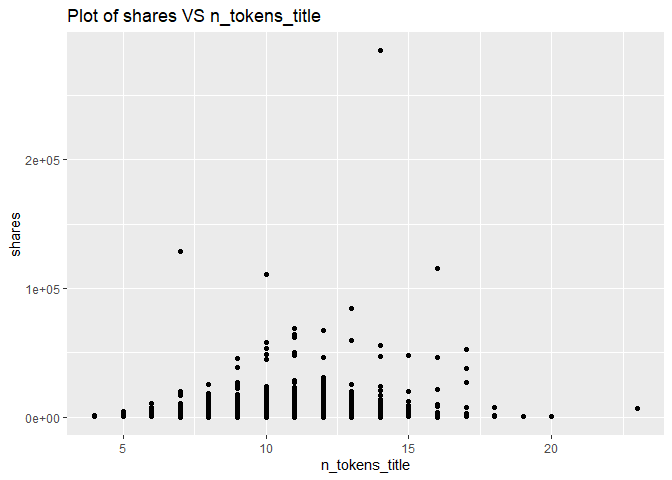
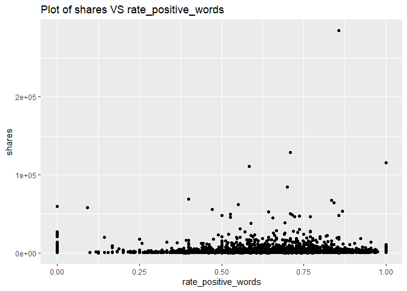

ST558 - Project 2
================
Li Wang & Bryan Bittner
2022-07-10

-   [Load Packages](#load-packages)
-   [Introduction](#introduction)
-   [Data](#data)
-   [Data Train/Test Split](#data-traintest-split)
-   [Summarizations](#summarizations)
    -   [Data structure and basic summary
        statistics](#data-structure-and-basic-summary-statistics)
    -   [Plots](#plots)
    -   [Feature selection](#feature-selection)
-   [Modeling](#modeling)
    -   [Linear Regression Model](#linear-regression-model)
    -   [Random Forest Model](#random-forest-model)
    -   [Boosted Tree Model](#boosted-tree-model)
-   [Comparison](#comparison)
-   [Automation](#automation)

``` r
rmarkdown::render("Project2.Rmd", 
                  output_format = "github_document",
                  output_file = "README.md",
                  output_options = list(html_preview= FALSE,toc=TRUE,toc_depth=2,toc_float=TRUE)
)
```

# Load Packages

We will use the following packages:

``` r
library(rmarkdown)
library(httr)
library(jsonlite)
library(readr)
library(tidyverse)
library(lubridate)
library(knitr)
library(caret)
library(randomForest)
library(corrplot)
library(gbm)
```

# Introduction

This [online News Popularity Data
Set](https://archive.ics.uci.edu/ml/datasets/Online+News+Popularity)
summarizes a heterogeneous set of features about articles published by
Mashable in a period of two years.

Our target variable is the shares variable(Number of shares ), and
predict variables are the following:

-   publishing_day: Day of the article published
-   n_tokens_title: Number of words in the title
-   n_tokens_content: Number of words in the content
-   num_self_hrefs: Number of links to other articles published by
    Mashable
-   num_imgs: Number of images
-   num_videos: Number of videos
-   average_token_length: Average length of the words in the content
-   num_keywords: Number of keywords in the metadata
-   kw_avg_min: Worst keyword (avg. shares)
-   kw_avg_avg: Avg. keyword (avg. shares)
-   self_reference_avg_shares: Avg. shares of referenced articles in
    Mashable
-   LDA_04: Closeness to LDA topic 4
-   global_subjectivity: ext subjectivity
-   global_rate_positive_words: Rate of positive words in the content
-   rate_positive_words: Rate of positive words among non-neutral tokens
-   avg_positive_polarity: Avg. polarity of positive words
-   min_positive_polarity: Min. polarity of positive words
-   avg_negative_polarity: Avg. polarity of negative words
-   max_negative_polarity: Max. polarity of negative words
-   title_subjectivity: Title subjectivity

The purpose of our analysis is to predict the number of shares in social
networks (popularity). In this project, we produce some basic summary
statistics and plots about the training data, and fit a linear
regression model and an ensemble tree-based model.

# Data

Use a relative path to import the data.

``` r
newsData<-read_csv(file="../Datasets/OnlineNewsPopularity.csv")
head(newsData)
```

    ## # A tibble: 6 × 61
    ##   url                timedelta n_tokens_title n_tokens_content n_unique_tokens n_non_stop_words n_non_stop_uniq… num_hrefs
    ##   <chr>                  <dbl>          <dbl>            <dbl>           <dbl>            <dbl>            <dbl>     <dbl>
    ## 1 http://mashable.c…       731             12              219           0.664             1.00            0.815         4
    ## 2 http://mashable.c…       731              9              255           0.605             1.00            0.792         3
    ## 3 http://mashable.c…       731              9              211           0.575             1.00            0.664         3
    ## 4 http://mashable.c…       731              9              531           0.504             1.00            0.666         9
    ## 5 http://mashable.c…       731             13             1072           0.416             1.00            0.541        19
    ## 6 http://mashable.c…       731             10              370           0.560             1.00            0.698         2
    ## # … with 53 more variables: num_self_hrefs <dbl>, num_imgs <dbl>, num_videos <dbl>, average_token_length <dbl>,
    ## #   num_keywords <dbl>, data_channel_is_lifestyle <dbl>, data_channel_is_entertainment <dbl>, data_channel_is_bus <dbl>,
    ## #   data_channel_is_socmed <dbl>, data_channel_is_tech <dbl>, data_channel_is_world <dbl>, kw_min_min <dbl>,
    ## #   kw_max_min <dbl>, kw_avg_min <dbl>, kw_min_max <dbl>, kw_max_max <dbl>, kw_avg_max <dbl>, kw_min_avg <dbl>,
    ## #   kw_max_avg <dbl>, kw_avg_avg <dbl>, self_reference_min_shares <dbl>, self_reference_max_shares <dbl>,
    ## #   self_reference_avg_sharess <dbl>, weekday_is_monday <dbl>, weekday_is_tuesday <dbl>, weekday_is_wednesday <dbl>,
    ## #   weekday_is_thursday <dbl>, weekday_is_friday <dbl>, weekday_is_saturday <dbl>, weekday_is_sunday <dbl>, …

Subset the data. If running the reports by an automated parameter driven
process, the report will automatically use the parameter passed into
this report. If running the report manually without a parameter, the
data will subset to the ‘lifestyle’ news channel.

``` r
#Read the parameter being passed in to the automated report
if (params$columnNames != "") {
  paramColumnNameType<-params$columnNames
}else{
  paramColumnNameType<-"lifestyle"
}

columnName<-paste("data_channel_is_",paramColumnNameType,sep="")

#According to dplyr help, to refer to column names stored as string, use the '.data' pronoun.
#https://dplyr.tidyverse.org/reference/filter.html
newsDataSubset <- filter(newsData,.data[[columnName]] == 1)
```

Merging the weekdays columns channels as one single column named
publishing_day.

``` r
# Merging the weekdays columns channels as one single column named publishing_day
newsDataSubset <- newsDataSubset %>%
  select(url, starts_with("weekday_is")) %>%
  pivot_longer(-url) %>%
  dplyr::filter(value > 0) %>%
  mutate(publishing_day = gsub("weekday_is_", "", name)) %>%
  left_join(newsDataSubset, by = "url") %>%
  select(-name, -starts_with("weekday_is_"))

# set the publishing_day as factor variable
newsDataSubset$publishing_day<- as.factor(newsDataSubset$publishing_day)
head(newsDataSubset)
```

    ## # A tibble: 6 × 56
    ##   url     value publishing_day timedelta n_tokens_title n_tokens_content n_unique_tokens n_non_stop_words n_non_stop_uniq…
    ##   <chr>   <dbl> <fct>              <dbl>          <dbl>            <dbl>           <dbl>            <dbl>            <dbl>
    ## 1 http:/…     1 monday               731             10              231           0.636             1.00            0.797
    ## 2 http:/…     1 monday               731              9             1248           0.490             1.00            0.732
    ## 3 http:/…     1 monday               731             12              682           0.460             1.00            0.635
    ## 4 http:/…     1 monday               731              9              391           0.510             1.00            0.650
    ## 5 http:/…     1 monday               731             11              125           0.675             1.00            0.797
    ## 6 http:/…     1 monday               731             11              799           0.504             1.00            0.738
    ## # … with 47 more variables: num_hrefs <dbl>, num_self_hrefs <dbl>, num_imgs <dbl>, num_videos <dbl>,
    ## #   average_token_length <dbl>, num_keywords <dbl>, data_channel_is_lifestyle <dbl>, data_channel_is_entertainment <dbl>,
    ## #   data_channel_is_bus <dbl>, data_channel_is_socmed <dbl>, data_channel_is_tech <dbl>, data_channel_is_world <dbl>,
    ## #   kw_min_min <dbl>, kw_max_min <dbl>, kw_avg_min <dbl>, kw_min_max <dbl>, kw_max_max <dbl>, kw_avg_max <dbl>,
    ## #   kw_min_avg <dbl>, kw_max_avg <dbl>, kw_avg_avg <dbl>, self_reference_min_shares <dbl>,
    ## #   self_reference_max_shares <dbl>, self_reference_avg_sharess <dbl>, is_weekend <dbl>, LDA_00 <dbl>, LDA_01 <dbl>,
    ## #   LDA_02 <dbl>, LDA_03 <dbl>, LDA_04 <dbl>, global_subjectivity <dbl>, global_sentiment_polarity <dbl>, …

Here we drop some non-preditive variables:
url,value,timedelta,data_channel_is_lifestyle,
data_channel_is_entertainment,data_channel_is_bus,
data_channel_is_socmed ,data_channel_is_tech,data_channel_is_world
columns,is_weekend. They won’t contribute anything.

``` r
newsDataSubset<-newsDataSubset%>%select(-c(1,2,4,16:21,34))
newsDataSubset
```

    ## # A tibble: 8,427 × 46
    ##    publishing_day n_tokens_title n_tokens_content n_unique_tokens n_non_stop_words n_non_stop_unique_tokens num_hrefs
    ##    <fct>                   <dbl>            <dbl>           <dbl>            <dbl>                    <dbl>     <dbl>
    ##  1 monday                     10              231           0.636             1.00                    0.797         4
    ##  2 monday                      9             1248           0.490             1.00                    0.732        11
    ##  3 monday                     12              682           0.460             1.00                    0.635        10
    ##  4 monday                      9              391           0.510             1.00                    0.650         9
    ##  5 monday                     11              125           0.675             1.00                    0.797         1
    ##  6 monday                     11              799           0.504             1.00                    0.738         8
    ##  7 monday                     11              317           0.611             1.00                    0.729         7
    ##  8 monday                     11              399           0.598             1.00                    0.806         8
    ##  9 monday                      9              443           0.467             1.00                    0.589         3
    ## 10 tuesday                    12              288           0.589             1.00                    0.726         5
    ## # … with 8,417 more rows, and 39 more variables: num_self_hrefs <dbl>, num_imgs <dbl>, num_videos <dbl>,
    ## #   average_token_length <dbl>, num_keywords <dbl>, kw_min_min <dbl>, kw_max_min <dbl>, kw_avg_min <dbl>,
    ## #   kw_min_max <dbl>, kw_max_max <dbl>, kw_avg_max <dbl>, kw_min_avg <dbl>, kw_max_avg <dbl>, kw_avg_avg <dbl>,
    ## #   self_reference_min_shares <dbl>, self_reference_max_shares <dbl>, self_reference_avg_sharess <dbl>, LDA_00 <dbl>,
    ## #   LDA_01 <dbl>, LDA_02 <dbl>, LDA_03 <dbl>, LDA_04 <dbl>, global_subjectivity <dbl>, global_sentiment_polarity <dbl>,
    ## #   global_rate_positive_words <dbl>, global_rate_negative_words <dbl>, rate_positive_words <dbl>,
    ## #   rate_negative_words <dbl>, avg_positive_polarity <dbl>, min_positive_polarity <dbl>, max_positive_polarity <dbl>, …

# Data Train/Test Split

Lets set up our Train/Test split. This will allow us to determine the
model fit using a subset of data called Training, while saving the
remainder of the data called Test to test our model predictions with.

``` r
set.seed(111)
train <- sample(1:nrow(newsDataSubset),size=nrow(newsDataSubset)*0.7)
test <- dplyr::setdiff(1:nrow(newsDataSubset),train)

newsDataSubsetTrain <- newsDataSubset[train,]
newsDataSubsetTest <- newsDataSubset[test,]
```

# Summarizations

## Data structure and basic summary statistics

Start with the data structure and basic summary statistics for the
‘shares’ field.

``` r
# data structure
str(newsDataSubsetTrain)
```

    ## tibble [5,898 × 46] (S3: tbl_df/tbl/data.frame)
    ##  $ publishing_day              : Factor w/ 7 levels "friday","monday",..: 7 5 1 4 6 1 1 5 3 7 ...
    ##  $ n_tokens_title              : num [1:5898] 9 13 8 12 11 10 8 8 8 12 ...
    ##  $ n_tokens_content            : num [1:5898] 483 1231 327 1451 512 ...
    ##  $ n_unique_tokens             : num [1:5898] 0.528 0.375 0.495 0.421 0.575 ...
    ##  $ n_non_stop_words            : num [1:5898] 1 1 1 1 1 ...
    ##  $ n_non_stop_unique_tokens    : num [1:5898] 0.686 0.549 0.515 0.59 0.768 ...
    ##  $ num_hrefs                   : num [1:5898] 10 5 5 23 2 14 6 10 1 18 ...
    ##  $ num_self_hrefs              : num [1:5898] 6 2 2 2 1 0 1 1 1 1 ...
    ##  $ num_imgs                    : num [1:5898] 1 1 1 4 1 1 1 2 1 2 ...
    ##  $ num_videos                  : num [1:5898] 0 1 1 1 0 0 0 0 0 4 ...
    ##  $ average_token_length        : num [1:5898] 5.1 4.82 4.78 4.93 4.72 ...
    ##  $ num_keywords                : num [1:5898] 6 5 6 8 5 9 6 10 4 5 ...
    ##  $ kw_min_min                  : num [1:5898] -1 -1 4 -1 4 4 -1 -1 -1 -1 ...
    ##  $ kw_max_min                  : num [1:5898] 1100 1100 33900 1100 1500 399 818 663 0 5700 ...
    ##  $ kw_avg_min                  : num [1:5898] 182 405 6885 364 721 ...
    ##  $ kw_min_max                  : num [1:5898] 1100 1300 0 0 7200 0 0 0 67700 4100 ...
    ##  $ kw_max_max                  : num [1:5898] 843300 843300 690400 843300 690400 ...
    ##  $ kw_avg_max                  : num [1:5898] 255183 323140 335050 167325 275380 ...
    ##  $ kw_min_avg                  : num [1:5898] 1100 1150 0 0 2191 ...
    ##  $ kw_max_avg                  : num [1:5898] 3484 6182 33900 3386 5333 ...
    ##  $ kw_avg_avg                  : num [1:5898] 2317 3074 7717 1942 3591 ...
    ##  $ self_reference_min_shares   : num [1:5898] 115 713 811 2000 9700 0 381 1300 829 854 ...
    ##  $ self_reference_max_shares   : num [1:5898] 1200 1600 811 11700 9700 0 381 1300 829 854 ...
    ##  $ self_reference_avg_sharess  : num [1:5898] 731 1156 811 6850 9700 ...
    ##  $ LDA_00                      : num [1:5898] 0.0333 0.04 0.0333 0.025 0.04 ...
    ##  $ LDA_01                      : num [1:5898] 0.0333 0.04 0.0333 0.0254 0.04 ...
    ##  $ LDA_02                      : num [1:5898] 0.867 0.84 0.867 0.775 0.84 ...
    ##  $ LDA_03                      : num [1:5898] 0.0333 0.04 0.0334 0.0252 0.04 ...
    ##  $ LDA_04                      : num [1:5898] 0.0333 0.04 0.0333 0.1495 0.04 ...
    ##  $ global_subjectivity         : num [1:5898] 0.305 0.43 0.379 0.393 0.431 ...
    ##  $ global_sentiment_polarity   : num [1:5898] 0.0763 -0.0772 0.0577 0.0608 0.1496 ...
    ##  $ global_rate_positive_words  : num [1:5898] 0.0248 0.0138 0.0336 0.02 0.041 ...
    ##  $ global_rate_negative_words  : num [1:5898] 0.00828 0.03006 0.01529 0.01999 0.00781 ...
    ##  $ rate_positive_words         : num [1:5898] 0.75 0.315 0.688 0.5 0.84 ...
    ##  $ rate_negative_words         : num [1:5898] 0.25 0.685 0.312 0.5 0.16 ...
    ##  $ avg_positive_polarity       : num [1:5898] 0.322 0.264 0.335 0.438 0.307 ...
    ##  $ min_positive_polarity       : num [1:5898] 0.1 0.1 0.2 0.0625 0.05 0.0625 0.1 0.0625 0.1 0.1 ...
    ##  $ max_positive_polarity       : num [1:5898] 0.7 0.5 0.6 0.8 0.9 0.6 0.6 1 0.8 0.6 ...
    ##  $ avg_negative_polarity       : num [1:5898] -0.336 -0.249 -0.367 -0.26 -0.117 ...
    ##  $ min_negative_polarity       : num [1:5898] -0.5 -0.8 -0.7 -0.8 -0.2 -0.5 -0.5 -0.6 -0.2 -1 ...
    ##  $ max_negative_polarity       : num [1:5898] -0.2 -0.05 -0.167 -0.05 -0.05 ...
    ##  $ title_subjectivity          : num [1:5898] 0 1 0 0.05 0 ...
    ##  $ title_sentiment_polarity    : num [1:5898] 0 -0.25 0 -0.2 0 ...
    ##  $ abs_title_subjectivity      : num [1:5898] 0.5 0.5 0.5 0.45 0.5 ...
    ##  $ abs_title_sentiment_polarity: num [1:5898] 0 0.25 0 0.2 0 ...
    ##  $ shares                      : num [1:5898] 1000 873 860 1900 769 1300 589 1200 49 2300 ...

``` r
# data summary
summary(newsDataSubsetTrain$shares)
```

    ##    Min. 1st Qu.  Median    Mean 3rd Qu.    Max. 
    ##      41     827    1100    2283    1900  284700

Now lets show the Mean, Median, Variance, and Standard Deviation. Notice
the Variance and Standard Deviation are both extremely high. This might
be something we will have to investigate further.

``` r
newsDataSubsetTrain %>% summarise(avg = mean(shares), med = median(shares), var = var(shares), sd = sd(shares))
```

    ## # A tibble: 1 × 4
    ##     avg   med       var    sd
    ##   <dbl> <dbl>     <dbl> <dbl>
    ## 1 2283.  1100 38635066. 6216.

Looking at the different columns in the dataset, there are two that
stand out. Generally speaking, people probably aren’t going to look at
articles that don’t have images or videos. Here are the summary stats
for the articles grouped on the number of images in the article.

``` r
newsDataSubsetTrain %>% group_by(num_imgs) %>%
summarise(avg = mean(shares), med = median(shares), var = var(shares), sd = sd(shares))
```

    ## # A tibble: 47 × 5
    ##    num_imgs   avg   med        var     sd
    ##       <dbl> <dbl> <dbl>      <dbl>  <dbl>
    ##  1        0 3227.  1200 159596485. 12633.
    ##  2        1 1858.  1100  14046212.  3748.
    ##  3        2 1931.  1150   9308068.  3051.
    ##  4        3 2364.  1200  20725501.  4553.
    ##  5        4 2654.  1200  36013147.  6001.
    ##  6        5 3376.  1300  90403885.  9508.
    ##  7        6 2244.  1200  12064467.  3473.
    ##  8        7 3594.  1400  59477438.  7712.
    ##  9        8 2918.  1500  28104298.  5301.
    ## 10        9 2829.  1400  16511310.  4063.
    ## # … with 37 more rows

As we can see from the above table, the largest avg of shares is with 28
images, and the least avg of shares is with 23 images. Therefore, the
number of images variable affects shares, and we will keep this
variable.

Here are the summary stats for articles with videos.

``` r
newsDataSubsetTrain %>% group_by(num_videos) %>%
summarise(avg = mean(shares), med = median(shares), var = var(shares), sd = sd(shares))
```

    ## # A tibble: 20 × 5
    ##    num_videos   avg   med       var    sd
    ##         <dbl> <dbl> <dbl>     <dbl> <dbl>
    ##  1          0 2104. 1100  20180075. 4492.
    ##  2          1 2723. 1100  99793129. 9990.
    ##  3          2 2615. 1250  27642362. 5258.
    ##  4          3 2613. 1200  54786122. 7402.
    ##  5          4 2082. 1150   5491151. 2343.
    ##  6          5 2195. 1500   2484545. 1576.
    ##  7          6 2000. 1350   3482377. 1866.
    ##  8          7 1097. 1100    286624.  535.
    ##  9          8 1309. 1100    749186.  866.
    ## 10          9 1711. 1600    518611.  720.
    ## 11         10 2389. 1250   6543443. 2558.
    ## 12         11 6033. 4750  32076049. 5664.
    ## 13         12 1026. 1026.    60204.  245.
    ## 14         13 4100  4100        NA    NA 
    ## 15         14 2074. 2074.  2538004. 1593.
    ## 16         15 4300  4300        NA    NA 
    ## 17         16 2450  2450   1805000  1344.
    ## 18         20 8100  8100  92480000  9617.
    ## 19         21 2917  2300   6913567  2629.
    ## 20         23  700   700        NA    NA

As we can see from the above table, the largest avg of shares is with 15
videos, and the least avg of shares is with 28 videos Therefore, the
number of videos variable affects shares, and we will keep this
variable.

## Plots

A plot with the number of shares on the y-axis and n_tokens_title on the
x-axis is created:

``` r
g <- ggplot(newsDataSubsetTrain, aes(x = n_tokens_title, y = shares))
g + geom_point()+labs(title = "Plot of shares VS n_tokens_title")
```

<!-- -->

From the above plot, we can see that the most shares is with 6-15 words
in the title. Therefore, the number of words in the title affects
shares, and we will keep n_tokens_title variable.

A plot with the number of shares on the y-axis and publishing_day on the
x-axis is created:

``` r
g <- ggplot(newsDataSubsetTrain, aes(x = publishing_day, y = shares))
g + geom_point()+labs(title = "Plot of shares VS publishing_day")
```

<!-- -->

From the above plot, we can see that the best popular articles are
usually posted on Monday, Tuesday, and Wednesday. Articles is less
popularity which are published on Sunday and Saturday. Therefore, the
publishing_day affects shares, and we will keep publishing_day.

A plot with the number of shares on the y-axis and rate_positive_words
on the x-axis is created:

``` r
g <- ggplot(newsDataSubsetTrain, aes(x = rate_positive_words, y = shares))
g + geom_point()+labs(title = "Plot of shares VS rate_positive_words")
```

<!-- -->

From the above plot, we can see that the best popular articles are with
0.5-0.9 rate_positive_words. Therefore, the variable rate_positive_words
effects shares, and we will keep this variable.

A plot with the number of shares on the y-axis and n_tokens_content on
the x-axis is created:

``` r
g <- ggplot(newsDataSubsetTrain, aes(x = n_tokens_content, y = shares))
g + geom_point()+labs(title = "Plot of shares VS n_tokens_content")
```

<!-- -->

From the above plot, we can see that the number of words in the article
less than 2000 words are with good shares. The less the better.
Therefore, the variable n_tokens_content effects shares, and we will
keep this variable.

A plot with the number of shares on the y-axis and average_token_length
on the x-axis is created:

``` r
g <- ggplot(newsDataSubsetTrain, aes(x = average_token_length, y = shares))
g + geom_point()+labs(title = "Plot of shares VS average_token_length")
```

<!-- -->

From the above plot, we can see that the almost shares are with 4-6
length word. Therefore, the variable average_token_length effects
shares, and we will keep this variable.

Correlation matrix plot is generated:

``` r
newsDataSubsetTrain1<-select(newsDataSubsetTrain,-publishing_day)
corr=cor(newsDataSubsetTrain1, method = c("spearman"))
corrplot(corr,tl.cex=0.5)
```

<!-- -->

By the above correlation matrix plot, we can see these variables are
strongly correlated:

-   title_subjectivity, abs_title_sentiment_polarity,
    abs_title_subjectivity, title_sentiment_polarity
-   avg_negative_polarity, min_negative_polarity
-   max_positive_polarity, avg_positive_polarity
-   global_rate_negative_words, rate_negative_words,rate_positive_words
-   global_sentiment_polarity, rate_negative_words, rate_positive_words
-   LDA_03,LDA_04
-   LDA_00,LDA_04
-   self_reference_max_shares, self_reference_avg_shares,
    self_reference_min_shares
-   kw_max_avg, kw_avg_avg
-   kw_min_avg,kw_avg_avg,kw_min_max
-   kw_avg_max,kw_avg_avg,kw_max_max
-   kw_avg_min,kw_avg_max
-   kw_max_min,kw_avg_min,kw_min_min
-   kw_min_min,kw_avg_max
-   num_keywords,LDA_01
-   num_keywords,LDA_02
-   num_hrefs, num_imgs
-   n_non_stop_unique_tokens, num_imgs
-   n_non_stop_words, n_non_stop_unique_tokens
-   n_unique_tokens,n_non_stop_unique_tokens
-   n_unique_tokens, n_non_stop_words, n_tokens_content
-   n_tokens_content, n_non_stop_unique_tokens
-   n_tokens_content, num_hrefs

These are strongly correlated which makes us to assume that these
features are so linearly dependent that any one of the strong correlated
feature can be used and excluding the other features with high
correlation.

## Feature selection

Let’s do feature selection:

``` r
newsDataSubsetTrain2<-select(newsDataSubsetTrain,-abs_title_sentiment_polarity, -abs_title_subjectivity, -title_sentiment_polarity,-min_negative_polarity,-max_positive_polarity,-rate_negative_words,-global_rate_negative_words,-global_sentiment_polarity,-LDA_03,-LDA_00,-self_reference_max_shares,-self_reference_min_shares,-kw_max_avg,-kw_min_avg,-kw_min_max,-kw_avg_max,-kw_max_max,-kw_max_min,-kw_min_min,-LDA_01,-LDA_02,-num_hrefs,-n_non_stop_unique_tokens,-n_unique_tokens,-n_non_stop_words)

newsDataSubsetTest2<-select(newsDataSubsetTrain,-abs_title_sentiment_polarity, -abs_title_subjectivity, -title_sentiment_polarity,-min_negative_polarity,-max_positive_polarity,-rate_negative_words,-global_rate_negative_words,-global_sentiment_polarity,-LDA_03,-LDA_00,-self_reference_max_shares,-self_reference_min_shares,-kw_max_avg,-kw_min_avg,-kw_min_max,-kw_avg_max,-kw_max_max,-kw_max_min,-kw_min_min,-LDA_01,-LDA_02,-num_hrefs,-n_non_stop_unique_tokens,-n_unique_tokens,-n_non_stop_words)
```

# Modeling

## Linear Regression Model

A Linear Regression Model is the first model type we will look at. These
models are an intuitive way to investigate the linear relation between
multiple variables. These models make the estimation procedure simple
and easy to understand. Linear Regression models can come in all
different shapes and sizes and can be used to model more than just a
straight linear relationship. Regression models can be modified with
interactive and or higher order terms that will conform to a more
complex relationship.

For the first linear model example, we can try a model using just the
“num_imgs” and “num_videos” as our predictors.

``` r
set.seed(111)
#Fit a  multiple linear regression model using just the "num_imgs" and "num_videos" as our predictors. 
mlrFit <- train(shares ~ num_imgs + num_videos, 
                data = newsDataSubsetTrain2, 
                method="lm",
                trControl=trainControl(method="cv",number=5))
mlrFit
```

    ## Linear Regression 
    ## 
    ## 5898 samples
    ##    2 predictor
    ## 
    ## No pre-processing
    ## Resampling: Cross-Validated (5 fold) 
    ## Summary of sample sizes: 4719, 4719, 4718, 4718, 4718 
    ## Resampling results:
    ## 
    ##   RMSE      Rsquared    MAE     
    ##   5805.983  0.01550768  1921.748
    ## 
    ## Tuning parameter 'intercept' was held constant at a value of TRUE

Next we can try a linear model using all of the fields as a predictor
variables.

``` r
#Fit a  multiple linear regression model using all of the fields as a predictor variables.
set.seed(111)
mlrAllFit <- train(shares ~ ., 
                data = newsDataSubsetTrain2, 
                method="lm",
                trControl=trainControl(method="cv",number=5))
mlrAllFit
```

    ## Linear Regression 
    ## 
    ## 5898 samples
    ##   20 predictor
    ## 
    ## No pre-processing
    ## Resampling: Cross-Validated (5 fold) 
    ## Summary of sample sizes: 4719, 4719, 4718, 4718, 4718 
    ## Resampling results:
    ## 
    ##   RMSE      Rsquared    MAE     
    ##   5786.933  0.02640437  1934.528
    ## 
    ## Tuning parameter 'intercept' was held constant at a value of TRUE

Try a model using just the num_imgs + num_videos + kw_avg_avg +
num_imgs\*kw_avg_avg as our predictors.

``` r
set.seed(111)
#Fit a  multiple linear regression model with num_imgs + num_videos + kw_avg_avg + num_imgs*kw_avg_avg. 
mlrInteractionFit <- train(shares ~ num_imgs + num_videos + kw_avg_avg + num_imgs*kw_avg_avg, 
                data = newsDataSubsetTrain2, 
                method="lm",
                trControl=trainControl(method="cv",number=5))
mlrInteractionFit
```

    ## Linear Regression 
    ## 
    ## 5898 samples
    ##    3 predictor
    ## 
    ## No pre-processing
    ## Resampling: Cross-Validated (5 fold) 
    ## Summary of sample sizes: 4719, 4719, 4718, 4718, 4718 
    ## Resampling results:
    ## 
    ##   RMSE     Rsquared    MAE     
    ##   5795.05  0.01989943  1897.142
    ## 
    ## Tuning parameter 'intercept' was held constant at a value of TRUE

## Random Forest Model

The Random Forest Model is an example of an ensemble based model.
Instead of traditional decision trees, ensemble methods average across
the tree. This will greatly increase our prediction power, but it will
come at the expense of the easy interpretation from traditional decision
trees. The Random Forest based model will not use all available
predictors. Instead it will take a random subset of the predictors for
each tree fit and calculate the model fit for that subset. It will
repeat the process a pre-determined number of times and automatically
pick the best predictors for the model. This will end up creating a
reduction in the overall model variance.

``` r
set.seed(111)
randomForestFit <- train(shares ~ ., 
                         data = newsDataSubsetTrain2, 
                         method="rf",
                         preProcess=c("center","scale"),
                         trControl=trainControl(method="cv",number=5),
                         tuneGrid=data.frame(mtry=ncol(newsDataSubsetTrain)/3))
randomForestFit
```

    ## Random Forest 
    ## 
    ## 5898 samples
    ##   20 predictor
    ## 
    ## Pre-processing: centered (25), scaled (25) 
    ## Resampling: Cross-Validated (5 fold) 
    ## Summary of sample sizes: 4719, 4719, 4718, 4718, 4718 
    ## Resampling results:
    ## 
    ##   RMSE      Rsquared    MAE    
    ##   6002.058  0.01732569  2027.62
    ## 
    ## Tuning parameter 'mtry' was held constant at a value of 15.33333

## Boosted Tree Model

Boosted Regression Tree (BRT) models are a combination of two
techniques: decision tree algorithms and boosting methods. It repeatedly
fits many decision trees to improve the accuracy of the model.

Boosted Regression Tree uses the boosting method in which the input data
are weighted in subsequent trees. The weights are applied in such a way
that data that was poorly modelled by previous trees has a higher
probability of being selected in the new tree. This means that after the
first tree is fitted the model will take into account the error in the
prediction of that tree to fit the next tree, and so on. By taking into
account the fit of previous trees that are built, the model continuously
tries to improve its accuracy. This sequential approach is unique to
boosting.

``` r
set.seed(111)
BoostedTreeFit <- train(shares ~ ., 
                         data = newsDataSubsetTrain2,
                         distribution = "gaussian",
                         method="gbm",
                         trControl=trainControl(method="cv",number=5),
                         verbose = FALSE)
BoostedTreeFit
```

    ## Stochastic Gradient Boosting 
    ## 
    ## 5898 samples
    ##   20 predictor
    ## 
    ## No pre-processing
    ## Resampling: Cross-Validated (5 fold) 
    ## Summary of sample sizes: 4719, 4719, 4718, 4718, 4718 
    ## Resampling results across tuning parameters:
    ## 
    ##   interaction.depth  n.trees  RMSE      Rsquared     MAE     
    ##   1                   50      5812.856  0.015512315  1905.712
    ##   1                  100      5808.487  0.018582002  1900.406
    ##   1                  150      5820.358  0.018431169  1916.575
    ##   2                   50      5886.347  0.012257053  1924.130
    ##   2                  100      5957.842  0.011295020  1947.919
    ##   2                  150      5999.151  0.009922377  1968.353
    ##   3                   50      5904.158  0.016515410  1924.161
    ##   3                  100      5938.742  0.019517398  1956.560
    ##   3                  150      5941.038  0.023618901  1969.494
    ## 
    ## Tuning parameter 'shrinkage' was held constant at a value of 0.1
    ## Tuning parameter 'n.minobsinnode' was held constant at
    ##  a value of 10
    ## RMSE was used to select the optimal model using the smallest value.
    ## The final values used for the model were n.trees = 100, interaction.depth = 1, shrinkage = 0.1 and n.minobsinnode = 10.

# Comparison

All the models are compared by RMSE on the test set

``` r
set.seed(111)
#compute RMSE of MlrFit
mlrFitPred <- predict(mlrFit, newdata = newsDataSubsetTest2)
MlrFit<-postResample(mlrFitPred, newsDataSubsetTest2$shares)
MlrFit.RMSE<-MlrFit[1]

#compute RMSE of MlrAllFit
MlrAllFitPred <- predict(mlrAllFit, newdata = newsDataSubsetTest2)
MlrAllFit<-postResample(MlrAllFitPred, newsDataSubsetTest2$shares)
MlrAllFit.RMSE<-MlrAllFit[1]

#compute RMSE of MlrInterFit
mlrInteractionFitPred <- predict(mlrInteractionFit, newdata = newsDataSubsetTest2)
MlrInterFit<-postResample(mlrInteractionFitPred, newsDataSubsetTest2$shares)
MlrInterFit.RMSE<-MlrInterFit[1]

#compute RMSE of RandomForest
ForestPred <- predict(randomForestFit, newdata = newsDataSubsetTest2)
RandomForest<-postResample(ForestPred, newsDataSubsetTest2$shares)
RandomForest.RMSE<-RandomForest[1]

#compute RMSE of BoostedTree
BoostPred <- predict(BoostedTreeFit, newdata = newsDataSubsetTest2)
BoostedTree<-postResample(BoostPred, newsDataSubsetTest2$shares)
BoostedTree.RMSE<-BoostedTree[1]

#Compare Root MSE values
c(MlrFit=MlrFit.RMSE,MlrAllFit=MlrAllFit.RMSE,MlrInterFit=MlrInterFit.RMSE,RandomForest=RandomForest.RMSE,BoostedTree=BoostedTree.RMSE)
```

    ##       MlrFit.RMSE    MlrAllFit.RMSE  MlrInterFit.RMSE RandomForest.RMSE  BoostedTree.RMSE 
    ##          6184.453          6118.293          6169.010          2946.161          5938.232

From the above compare, we can see the smallest RMSE is 5403.120 which
belong to RandomForest. Therefore, we will choose the Random Forest
Model.

# Automation

Below is a chuck of code that can be used to automate the reports. In
order to automate this project, the first thing we do is build a set of
parameters. These parameters match up with the column names from the
full news dataset. The program with read the parameter and subset the
data down to only values with the specified news channel name that is in
the parameter.

To automate the project for all of the different news channels, simply
execute the code chunk below directly to the console. Separate .md files
will then be created for each news channel type.

``` automate
#Add column names
columnNames <- data.frame("lifestyle","entertainment","bus","socmed","tech","world")

#Create filenames
output_file<-paste0(columnNames,".md")

#create a list for each column name
params = lapply(columnNames, FUN = function(x){list(columnNames = x)})

#put into a data frame
reports<-tibble(output_file,params)

#Render Code
apply(reports, MARGIN=1,FUN=function(x)
  {
    rmarkdown::render(input="Project2.Rmd",
    output_format="github_document",
    output_file=x[[1]],
    params=x[[2]],
    output_options = list(html_preview= FALSE,toc=TRUE,toc_depth=2,toc_float=TRUE)
    )
  }
)
```
